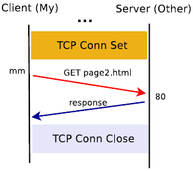
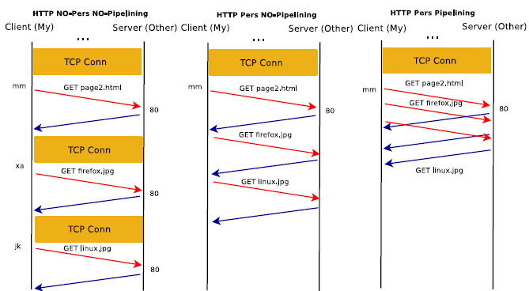
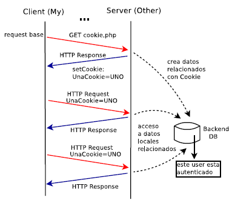
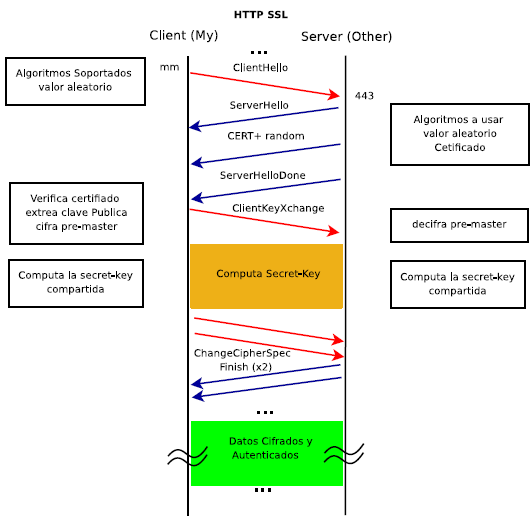
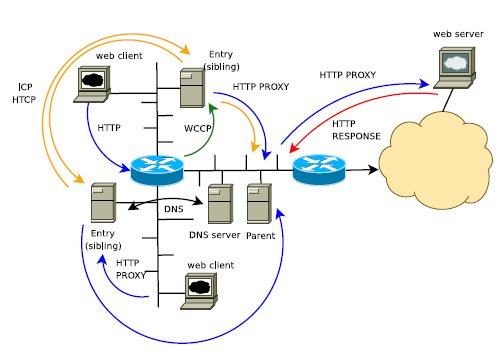
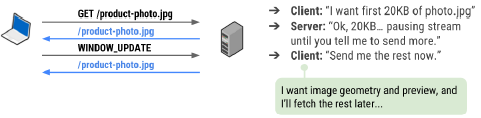

# Capa aplicación

- [HTTP](#HTTP)
- DNS
- Correo
- FTP

# HTTP

Formato URL: protocol://[user:pass@]host:[port]/[path]

- URI
- URL
- URN

## HTTP 0.9


<details>
<summary>Pasos</summary>
<br>
1. Establecer la conexión TCP
<br>
2. HTTP Request vía comando GET.
<br>
3. HTTP Response enviando la página requerida.
<br>
4. Cerrar la conexión TCP por parte del servidor.
<br>
5. Si no existe el documento o hay un error directamente se cierra la conexión.
</details>

- Solo una forma de Requerimiento.
- Solo una forma de Respuesta.



```
Request ::== GET <document-path> <CR><LF>
Response ::== ASCII chars HTML Document.

GET /hello.html <CR><LF>
GET / <CR><LF>
```

## HTTP 1.0

- Se debe especificar la versión en el requerimiento del cliente.
- Para los Request, define diferentes métodos HTTP.
- Define códigos de respuesta.
- Admite repertorio de caracteres, además del ASCII, como: ISO-8859-1, UTF-8, etc.
- Admite MIME (No solo sirve para descargar HTML e imágenes).
- Por default NO utiliza conexiones persistentes.

Request:

``````http
<Method> <URI> <Version>
[<Headers Opcionales>]
<Blank>
[<Entity Body Opcional>]
<Blank>
<Method HTTP 1.0> ::== GET, POST, HEAD, PUT,
DELETE, LINK, UNLINK
``````

Response:

```http
<HTTP Version> <Status Code> <Reason Phrase>
[<Headers Opcionales>]
<Blank>
[<Entity Body Opcional>]
```

<details>
<summary> <b>Métodos HTTP/1.0</b></summary>
<br>
- GET
<br>
- HEAD.
<br>
- POST
<br>
- PUT
<br>
- DELETE
<br>
- LINK,UNLINK
</details>
<details>
<summary> <b>Ejemplo Request Response 1.0</b></summary>
<br>
GET /index2.html HTTP/1.0<br>
User-Agent: telnet/andres (GNU/Linux)<br>
Host: estehost.com<br>
Accept: */*<br>
<br>
HTTP/1.1 200 OK<br>
Date: Mon, 21 Apr 2008 00:28:51 GMT<br>
Server: Apache/2.2.4 (Ubuntu)<br>
Last-Modified: Mon, 21 Apr 2008 00:18:14 GMT<br>
ETag: "a3b36-1f-91d5d80"<br>
Accept-Ranges: bytes<br>
Content-Length: 31<br>
Connection: close<br>
Content-Type: text/plain<br>
<br>
</details>
Los métodos PUT/DELETE ya existían en HTTP/1.0. No se implementan directamente en el servidor. Se deben agregar como una extensión CGI (Common Gateway Interface): para manejarlos.

- Common Gateway Interface: aplicación que interactúa con un servidor web.

### Autenticación HTTP

- HTTP/1.0 contempla autenticación con WWW-Authenticate Headers.
- Mediante encabezados, el cliente y el servidor intercambian información auth.
- El servidor, ante un requerimiento de un documento que requiere
  autenticación, enviará un mensaje 401 indicando la necesidad de autenticación y un Dominio/Realm.
- El navegador solicitará al usuario los datos de user/password (si es que no los tiene cachedos) y los enviará en texto claro al servidor.
- El servidor dará o no acceso en base a esos valores.
- Para los siguientes requerimientos, el navegador usará los valores que
  tiene almacenados para el Realm solicitado.

#### Conexiones persistentes

En HTTP/1.0 no se contemplaron las conexiones persistentes por default. A partir de HTTP/1.1 [RFC-2068], si. En HTTP/1.0 se pueden solicitar de forma explícita mediante el header "Connection: Keep-Alive"

## HTTP 1.1

Nuevos mensajes HTTP 1.1: OPTIONS, TRACE, CONNECT.

- Conexiones persistentes por omisión.
- Pipelining, mejora tiempo de respuestas.

#### Pipelining HTTP 1.1

- No necesita esperar la respuesta para pedir otro objeto HTTP
- Solo se utiliza con conexiones persistentes.
- Mejora los tiempos de respuestas.
- Sobre la misma conexión de debe mantener el orden de los objetos que se devuelven
- Se pueden utilizar varios threads para cada conexión.
  - Sin pipelining: 1RTT + FT por cada objeto, n objetos nRTT + nFT.
  - Con pipelining óptimo: n objetos: 1RTT + nFT.



#### Redirects HTTP

- Redirect temporal 302, indicando la nueva URL/URI.
- El user-agent no debería re-direccionarlo salvo que el usuario confirme.
- Moved Permanently 301, se indica que cualquier acceso futuro debe realizarse sobre la nueva ubicación (mejora Indexadores).
- Se pueden generar problemas con Cookies.

### Server-Side Script

- Ejecuta del lado del servidor.
- CGIs leen de STDIN (POST) o de variables de entorno (GET): QUERY STRING datos de usuario.
- Deben anteponer el content-type en el header.
- Lenguajes de scripting m´as flexibles y seguros: PHP, ASP, JSP.

### Client-Side Script:

- Ejecuta del lado del cliente, en el browser.
- JavaScript estándar W3C.
- Usan modelo de objetos DOM (Document Object Model).
- Otros lenguajes JScript, VBScript.
- Permiten extensiones como AJAX (Asynchronous JavaScript And XML).
- AJAX hace requerimientos particulares y no necesita recargar toda la página.
- Parseo XML para comunicarse.
- Existen numerosos frameworks que encapsulan esta funcionalidad brindando una interfaz de programación, API fácil de utilizar.

### Cookies

- Mecanismo que permite a las aplicaciones web del servidor “manejar estados”.
- El cliente hace un request.
- El servidor retorna un recurso (un objeto HTTP, como una página HTML) indicando al cliente que almacene determinados valores por un tiempo.
- La Cookie es introducida al cliente mediante el mensaje en el header "Set-Cookie: unaCookie=uno" que indica un par (nombre,valor).
- El cliente en cada requerimiento luego de haber almacenado la Cookie se la enviará al servidor con el header "Cookie: clave=valor"
- El servidor puede utilizarlo o no.
- El servidor puede borrarlo.
- Esta información puede ser usada por client-side scripts.



## HTTPS (HTTP sobre TLS/SSL)

- Utiliza el port 443 por default.
- Etapa de negociación previa.
- Luego se cifra y autentica todo el mensaje HTTP (incluso el header).



## WEB-Cache

- “Proxiar” y Chachear recursos HTTP.

- Objetivos:

  - Mejorar tiempo de respuesta (reducir retardo en descarga).
  - Ahorro de BW (recursos de la red).
  - Balance de carga, atender a todos los clientes.

- Se solicita el objeto, si esta en cache y esta “fresco” se retorna desde allí (HIT).

- Si el objeto no esta o es viejo se solicita al destino y se cachea (MISS).

- Se puede realizar control de acceso.

- Cache del lado del cliente.

- Los web browser tienen sus propias cache locales.

- Los servidores agregan headers:

  - Last-Modified: date
  - ETag: (entity tag) hash

- Requerimientos condicionales desde los clientes:

  - If-Modified-Since: date
  - If-None-Match: hash

- Respuestas de los servidores:

  - 304 Not Modified.
  - 200 OK.

- Los cache como servers funcionan como Proxy.

- Son servidores a los clientes y clientes a los servidores web.

- Los instalan ISP o redes grandes que desean optimizar el uso de los recursos.

Existen:

-   Proxy no-transparente.
-   Proxy transparentes.
-   Proxy en jerarquía o mesh (ICP y HTCP).
-   CDN (Content Delivery Network), funcionan por DNS.

##### Protocolos de comunicación entre web-cache servers:

- ICP (Internet Cache Protocol).
- (HTCP) Hyper Text Caching Protocol.

Diferentes relaciones: parent, siblings

##### Protocolo de comunicación entre router y web-cache servers: 

- WCCP (Web Cache Control Protocol).

En general corren sobre UDP.



## HTTP/2

Reemplazo de cómo HTTP se transporta. No es un reemplazo del protocolo completo.
https://docs.google.com/presentation/d/1r7QXGYOLCh4fcUq0jDdDwKJWNqWK1o4xMtYpKZCJYjM/present?slide=id.p19

### Problemas con HTTP/1.0, HTTP/1.1

- Un request por conexión, por vez, muy lento.
- Alternativas (evitar HOL):
  - Conexiones persistentes y pipelining.
  - Generar conexiones paralelas.

- Problemas:
  - Pipelining requiere que los responses sean enviado en el orden
  - solicitado, HOL posible.
  - POST no siempre pueden ser enviados en pipelining.
  - Demasiadas conexiones genera problemas, control de congestión,
  - mal uso de la red.
  - Muchos requests, muchos datos duplicados (headers).


### Diferencias principales con HTTP/1.1

- Protocolo **binario** en lugar de textual(ASCII), binary framing: (más eficiente).
- Multiplexa **varios request en una petición** en lugar de ser una secuencia ordenada y bloqueante.
- Utilizar una conexión para pedir/traer datos en paralelos, agrega: **datos fuera de orden**, **priorización**, flow control por frame.
- Usa **compresión de encabezado**.
- Permite a los servidores “pushear” datos a los clientes.
- La mayoría de las implementaciones requieren TLS/SSL, no el estándar.

### HTTP/2 mux stream, framing

- Puede generar una o más conexiones TCP. Trata de aprovechar las que tiene establecidas.
- Un **stream** es como una sub-conexión (una “conexión” http2 dentro de una conexión TCP).
- Un stream tiene un ID y una prioridad(alternativa) y son bidireccionales.
- Sobre una conexión TCP multiplexa uno o más streams (“conexiones http2”).
- Los streams transportan **mensajes**.
- Los mensajes http2 (Request, Response) se envían usando un stream.
- Los mensajes http2 son divididos en **frames** dentro del mismo stream.
- Los frames podrían ser de diferentes tipos.
- Un frame es una porción de mensaje: header fijo+payload variable (unidad mínima).
- Cada frame tiene un header en comun. Ej: HEADERS, DATA, DATA, DATA
- Frame types: HEADERS, DATA, PUSH_PROMISE, WINDOW_UPDATE, SETTINGS, etc.
- El mismo stream puede ser usado para llevar diferentes msj.

### HTTP/2 HEADERS

Se mantienen casi todos los HEADERs de HTTP/1.1.
No se codifican más en ASCII.
Surgen nuevos pseudo-headers que contiene información que estaba en el método y otros headers.
Por ejemplo: 

`HEAD /algo HTTP/1.1 `

se reemplaza con http2:

```
:method: head
:path: /algo
:scheme: https o http
:authority: www.site.com (reemplaza al headerHost: ).
```

Para las respuestas: `:status:` códigos de retornos 200, 301,
404, etc.

#### HTTP/2 priorización y flow-control

- Los streams dentro de una misma conexión tienen flow-control individual.
- El flow control permite al cliente pausar el stream delivery y resumirlo después.
- Los streams pueden tener un weight (prioridad).
- Los streams pueden estar asociados de forma jerárquica, dependencias.



- Cuando el cliente solicita una página, “parsea” el primer response HTML luego solicita el resto.
- El server puede enviar el HTML más otros datos, por ejemplo CSS o Javascript.
- No siempre es lo que necesita el cliente, depende de que funcionalidad ofrece.


#### Compresión y Soporte

- Compresión de encabezados.
- SPDY/2 propone usar GZIP.
- GZIP + cifrado, tiene “bugs” utilizados por atacantes.
- Se crea un nuevo compresor de Headers: HPACK.
- H2 y SPDY, soportados en la mayoría de los navegadores.

### Otras Características

- HTTP/1.1, posibilidad de hacer un upgrade durante la conexión:
  - Upgrade Header. Connection: Upgrade, HTTP2-Settings
  - Upgrade: h2c|h2.
- http2: Negociar el protocolo de aplicación:
  - ALPN: Application-Layer Protocol Negotiation.
  - Se negocia como extensión de SSL en Hello (Anteriormente NPN). Se ofrece: h2, h3, http/1.1, ...
- Posibilidad de negociar protocolo alternativo: Alternative Service: alt-svc.


## HTTP/3

Basado en HTTP over QUIC(UDP).

