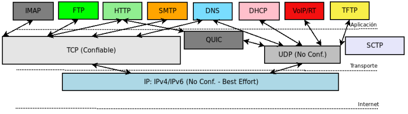
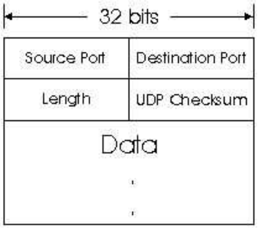
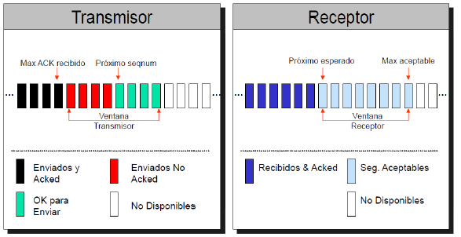

# Capa Transporte
comunicación lógica HOST-TO-HOST (END-TO-END), comunica procesos.

## Funcionalidad de Capa de Transporte
- MUX/DEMUX App. to App. (puertos, Ports).
- Soporte de datos de tamanos arbitrarios
- Control y Deteccion de Errores, pérdida, duplicación, se corrompen.
- ¿Como enviar info sobre la red de acuerdo al estado de la misma? ¿Cuando y cómo una App. debe enviar datos?
  - Control de Flujo.
  - Control de Congestion.
- Dos modelos:
  - Modelo Confiable: TCP.
  - Modelo NO Confiable: UDP.

Protocolos de transporte para cada protocolo de aplicación:

Trabaja con SEGMENTOS

Seleccion de protocolo de Transporte:La aplicacion de acuerdo a como esta programada selecciona el transporte. El acceso a los servicios de transporte se hace mediante API:**Network socket**.

# UDP vs TCP

## UDP
- User Datagram Protocol (RFC-768)
- Protocolo Minimalista. Menor Overhead.
- Características de IP: best-effort.
- Orientado a Packets/Datagramas (mensajes auto-contenidos)
- PDU: Datagrama (Por coherencia con nivel Transporte se suele llamar Segmento).
- Solo provee MUX/DEMUX.
- No requiere establecimiento de conexion
- Servicio FDX (dúplex completo (full-duplex, fdx) permite el envío de datos en ambas direcciones simultáneamente.)<!-- DUDA: OK?? -->
- Aplicaciones: video/voz streaming/TFTP/DNS/Bcast/Mcast

### Datagrama UDP

- Puertos: MUX/DEMUX.
- Longitud: UDP HDR + Payload
- Checksum
  - Calculo Ca1, **Opcional**. 0 = Sin checksum
  - Calculado HDR + PseudoHDR + Payload.
  - PseudoHDR: IP.SRC + IP.DST + Zero + IP.PROTO + UDP.LENGTH. <!-- DUDA -->
  - PseudoHDR: proteccion contra paquetes mal enrutados. 
  - Aplicaciones de LAN por eficiencia lo podrían deshabilitar.
  - Si tiene error se descarta silenciosamente (no tiene control de errores, sólo detección)

El encabezado UDP provee: 
- MUX/DEMUX de aplic.
- Detección de errores (no obligatorio).

## SCTP
- Stream Control Transmission Protocol (RFC-4960).
Protocolo con menor Overhead que TCP y más servicios que UDP.
Orientado a Packets/Datagramas/Mensajes.
Incrementa Overhead end-to-end.
Asegura orden, secuencia con control de congestión.
Servicio FDX.
Aplicaciones: WebRTC y ssh lo podría utilizar (no es lo más común).

## TCP
- Transport Control Protocol (RFC-793)
- Protocolo confiable, ordenado, buffering, control de flujo y de congestión.
- Orientado a Streams (secuencia en orden de bytes).<!-- DUDA = archivo ?? -->
- PDU: Segmento
- Provee MUX/DEMUX
- Incrementa Overhead end-to-end para ofrecer confiabilidad
- Requiere establecimiento de conexión (y cierre)
- Servicio FDX
- Aplicaciones: FTP/HTTP/SMTP/acceso remoto(SSH,telnet,...)/Unicast

El encabezado TCP provee:
- MUX/DEMUX
- Detección de errores
- Sesiones
- Control de Errores
- Control de Flujo
- Control de Congestión.

Segmento TCP

- Puertos: MUX/DEMUX.
- No tiene Longitud total, si de HDR LENGTH (variable, max 60B Unit=4B).
- Total LEN se computa para PseudoHDR, no viaja en el segmento.
- Checksum:
  - Cálculo Ca1. Obligatorio, calculado, igual que UDP.
  - Si tiene error podría pedir retransmisión, implementación de TCP descarta y espera RTO (Retransmission Timer).
- Necesidad de manejar Timers, RTO (tmout. por cada segmento). (implementaciones lo manejan máas eficiente).
 
- Campos de Sesiones: Flags: SYN, FIN.
- Campo de Detección de Errores: Checksum.
- Campos de Control de Errores: ACK, Nro. Sec (#Seq), Nro.Ack (#Ack).
- Campo de Control de Flujo: a los de errores se agrega, Win.
- Campos de Congestión: agrega flags si participa la red.
- Máquina de estado finita por cada conexión.
 
- Permite Opciones y Negociación.
- TCP entrega y envía lo datos agrupados o separados de forma dis-asociada de la aplicación:
  - La aplicación puede enviar 300 bytes en un write y TCP lo podría enviar en 3 segmentos separados de 100 bytes c/u.
  - La aplicación puede enviar 100 bytes y luego otros 200 y TCP esperar para enviarlos todos juntos.
  - La aplicación puede intentar leer 200 bytes del buffer y TCP solo entregar 150 bytes y luego el resto.

### Otros campos TCP

- TCP entrega y envía lo datos agrupados o separados de forma dis-asociada de la aplicación.
- Datos Urgentes: URG.
  - Urgent Pointer válido su URG=1.
  - Indica: offset positivo + #Seq = last Data Urgent byte.
  - Indicar a la App. datos urgentes, debe leer.
  - Debería combinarse con PSH. Habitualmente llamado OOB data (TCP no soporta OOB!!!).
- Pushear datos: PSH.
  - Fuerza a TCP a pasar datos a la App.
  - No lo deja “Bufferear” los datos recibidos (Input).

Urgent Pointer:

### Opciones TCP
- Maximum Segment Size (MSS), min. recomendado 536B, RFC-879 (basado en MTU=576, TCP+IP=40). Aclaraciones en RFC-6691.
- Window Scaling.
- Selective Acknowledgements (SACK).
- Timestamps.
- NOP.
- Otras.

## Establecimiento de Conexión
- Flags: SYN (Synchronize), ACK (Acknowledge) y RST (Reset).
- 3Way-Handsake (3WH).
- En el 3 segmento se puede enviar info.
- el ISN (Initial Sequence Number), se utiliza un contador que se incrementa cada 4 mseg.
- RST si no hay proceso en estado LISTEN.
- Open Pasivo (servidor) y Activo (cliente).
- Open simultáneo

### 3 way handshake

### 3 way handshake (open simultáneo)

## Control de Errores TCP
- Errores que pueden existir en IP:
  - Pérdida de paquetes: descartados.
  - Des-ordenados, retardados.
  - Duplicados.
  - Corrompidos.
- TCP intenta solucionarlos con el control de Errores que implementa.

## TCP Cierre de Conexión
- Flags: FIN (Finish), ACK y RST.
- 4Way-Close (4WC).
- Posibilidad de Half-Close.
- Podría cerrarse en 3WC.
- Espera en TIME WAIT, 2MSL (aprox. 2*2min).
- Evitar con SO_REUSEADDR.
- Cierre incorrecto con RST.
- Close simultáneo.

## TCP Diagrama de Estados
https://users.cs.northwestern.edu/~agupta/cs340/project2/TCPIP_State_Transition_Diagram.pdf

# Controles 
- Para realizar control de errores y control flujo se utilizan técnicas de ARQ (Automatic Repeat reQuest), Transferencia de Datos Fiables.
- ARQ solo no hace control de flujo, requiere de otros mecanismos como RNR, o Dynamic Window (Ventana Dinámica).
- La capacidad de envío será MIN(Congestion; Flujo; Errores).

# Control de errores
## Go-back N
<!-- TODO -->

# Control de errrores TCP

- Mecanismo protocolar, algoritmo, que permite ordenar los segmentos que llegan fuera de orden y recuperarse mediante solicitudes y/o retransmisiones de aquellos segmentos perdidos o con errores.
- Objetivo: recuperarse de los efectos del re-ordenamiento, la pérdida o la corrupción de los paquetes en la red. 
- Se realiza por cada conexión: End-to-End, App-to-App.

## resumen control errores:
- Segmentos ACked no indica leído por aplicación, sí recibido por TCP (RFC-793) (ubicado en el Rx Buffer del receptor).
- Si el receptor detecta error en el segmento simplemente descarta y espera que expire RTO en el emisor (podría envía un NAK, re-enviar ACK para el último recibido en orden, forma de solicitar lo que falta).
- Receptor con segmentos fuera de orden descarta directamente y podrá re-enviar ACK (podría dejar en Rx Buffer pero no entregar a la aplicación, tiene huecos).
- Se puede confirmar con ACK acumulativos.

- TCP NO arrancar un RTO por cada segmento, solo mantiene un por el más viejo enviado y no ACked y arranca uno nuevo solo si no hay RTO activo.
- Si se confirman (ACked) datos, se inicia un nuevo RTO (RFC-6298) recomendado.
- El nuevo RTO le esta dando más tiempo al segmento más viejo aún no confirmado.
- Si vence un RTO se debe retransmitir el segmento más viejo no ACKed y se debe doblar: Back-off timer RTO = RTO * 2
- RTOMAX = 60s (RFC-6298) recomendado.
- TCP calcula el RTO de forma dinámica. RFC-6298(2011), ayudado por Timestamp Option.

## (fin resumen)
<!-- Fin resumen -->

 

- TCP hace el control de errores **por bytes** (byte oriented), no por segmentos.
- Los segmentos se numeran de acuerdo a bytes enviados (nro. del primer byte).
- Los números se negocian al establecer la sesión y cada implementación los elige libremente (ISN).
- Las confirmaciones son “anticipativas”, indican el nro. de **byte que esperan**.
- Utiliza **Go-back-N con ventana dinámica** (flow-control), utiliza **piggy-backing** y permite **negociar Ventana Selectiva** con Opciones.
- Para control de errores TCP utiliza los campos: #SEQ, #ACK, flag ACK más timer y algunas opciones

 

- Por cada segmento (con datos) que envía TCP es como si iniciara un Timer local, RTO y pone copia del segmento en cola local (RFC-793) TxBuf .
- Por cada segmento ACKed descarta el timer asociado y descarta la copia del segmento (RFC-793) del TxBuf . Hace lugar para nuevos segmentos a Tx.

- Si RTO expira antes que se confirme el segmento TCP lo copia del TxBuf y retransmite (RFC-793).
- Segmentos ACked no indica leído por aplicación, sí recibido por TCP (RFC-793) (ubicado en el RxBuf del receptor).

- Si el receptor detecta error en el segmento simplemente descarta y espera que expire RTO en el emisor (podría envía un NAK, re-enviar ACK para el último recibido en orden, forma de solicitar lo que falta).

 

- Receptor con segmentos fuera de orden descarta directamente y podrá re-enviar ACK (podría dejar en RxBuf pero no entregar a la aplicación, tiene huecos).
- Se puede confirmar con ACK acumulativos.
- TCP NO arranca un RTO por cada segmento, solo mantiene un por el más viejo enviado y no ACked y arranca uno nuevo solo si no hay RTO activo.
- Si se confirman (ACked) datos, se inicia un nuevo RTO (RFC-6298) recomendado. Si todo confirmado se detiene RTO.

 
<!-- duda: ver diapo 31 de presentacion -->

- RTO debe ser dináamico, debe contemplar estado de la red.
- RTO estático solo sirve para L2 (directamente conectados).

Mínimo RTO: RTO < 1seg : redondeado a 1 seg (RFC-6298). Sistemas reales ignoran esta recomendación.

 

## TimeStamp
- RFC-1323.
- Se envía en el primer SYN el timeStamp local, opcional.
- En cada mensaje TCP con esta opción, se copia el timeStamp local y se hace echo del último timeStamp recibido desde otro extremo.
- Con el valor recibido como echo y el valor del reloj local se calcula el RTT.
- Si el mensaje no es un ACK válido no se actualiza la estimación del RTT SRTT.
- Relaja la necesidad de usar timer por cada segmento para estimar RTT.
- Protección contra Wraparounds de num. secuencia (PAWS).

<!-- todo: agregar imagen -->

# Flow Control TCP (control de flujo)

- Mecanismo protocolar, algoritmo, que permite al receptor controlar la tasa a la que le envía datos el transmisor.
- Controla cuanto puede enviar una aplicación sabiendo que la receptora tiene capacidad de recibirlo y procesarlo.
- Objetivo: prevenir que el emisor sobrecargue al receptor con datos evitando un mal uso de la red.
- Tiene en cuenta solo el estado del receptor, no de la red

 

De Extremo a Extremo, principio end-to-end.

- El receptor (cada extremo puede recibir, es FDX) indica el espacio del buffer de recepción (Rx Buffer), en el campo del
segmento: Window (de datos o ACK) Advertised Window (Ventana Anunciada).

- Por cada segmento que envía indica el tamaño del buffer de recepción Rx Buffer (mbufs). (Cada conexión mantiene su propio buffer) en espacio del kernel (TCP).
- Window (Ventana) indica la cantidad de datos en bytes que el emisor le puede enviar sin esperar confirmación (mejora notablemente contra Stop & Wait).
- La ventana de recepción de cada extremo es independiente.
- Cada vez que llega un segmento es puesto por TCP en el Rx Buffer, TCP lo debe confirmar.
- Cada vez que la aplicación lee se hace espacio en el Rx Buffer.
- Se va modificando el tamaño de la ventana.
- Cada vez que llega un ACK en orden se mueve la ventana en el transmisor, se descartan los segmentos confirmados de Tx Buffer.

<!-- ver explicacion en diapositivas -->

<!-- duda:revisar diapo 17, por q no deberia achicarse? -->

- Ventana de Recepción recibida: Win = rwnd.
- El receptor “ofrece/publica” la ventana Win en los segmentos TCP.
- El transmisor no puede enviar más de la cantidad de bytes en: 
  - Win - Sent_No_ACKed
  - Effective_Win = Win - (LastByteSent - LastByteAcked)
  si no se tiene en cuenta la congestión.

- Al recibir ACKs de TCP (App. no lee aún) se cierra ventana.
- Al recibir ACks y Win fijo desliza ventana (App. lee a rate fijo).
- Al achicarse Win se reduce ventana (App, no lee).
- Al agrandarse Win tiene posibilidad de enviar más (App. lee más rápido).
- Tamaño de ventana seleccionado por el kernel o por aplicación *setsockopt()*
- <!-- duda: Revisar diapo 19 -->

 

- Delayed ACKs: No enviar ACK sin esperar de enviar datos antes: 
  - piggy-back (200ms, MAX=500ms).
- Algoritmo Nagle: No enviar datos en chunks pequeños, esperar juntar información.
- Perjudica aplicaciones interactivas.
- Tinygrams: segmentos chicos: App. interactivas, Win casi vacía.
- Silly Window: Win casi llena se “ofrecen” pequeños incrementos.
  - Solución: Muestra incrementos de Min(MSS; RecvBuf )=2.

# Congestion control (control de congestión)

- Se realiza por cada conexión: End-to-End, App-to-App.
- O tomando partida la red. Modelo basado en la Red: IP+TCP:RFC-3168 (similar a mecanismos L2/L3: Frame-Relay, ATM).
- Permite que aplicaciones no saturen la capacidad de la red.
- Tiene en cuenta el estado de la red a diferencia del control de flujo que solo ve el receptor.
- Congestión: Problemas de delay en los routers, problemas de overflow y descarte.

## Causas de Congestion en la Red

- Límite de la capacidad de la red:
  - Velocidad de los Routers/Switches (CPU).
  - Capacidad de los Buffers de los Routers/Switches (Memoria).
  - Velocidad de los Enlaces (Interfaces).
- Utilizacion de la red: 
  - Demasiado trafico en la red (modelo de red compartida). 
  - Se detecta por los nodos intermedios (router/switches) por ejemplo: cuando las colas sobrepasan un umbral. Se utiliza simple umbral o doble umbral (min,max).

## Control de Congestion: Modelo End-to-End
- Modelo en el cual no participa la red (mas implementado).
- Se utilizan nuevos parametros a los de Control de Flujo (variables locales):
  - cwnd Ventana de congestion. tiene en cuenta el estado de  la red.
  - ssthresh Slow Start Threshold (Umbral).
  - Se calcula: M axW in = M in(rwnd, cwnd). rwnd era la ventana de recepcion, usada para el control de flujo.
