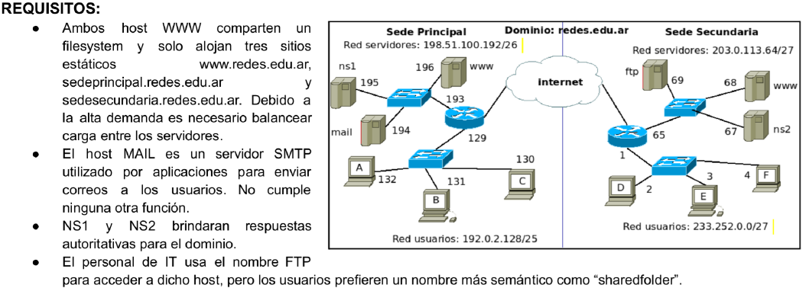

# 1

## a)Liste los registros DNS que deberia tener configurado ns1 para cumplir con los requisitos
"ns1 brinda respuesta autoritativa para el dominio redes.edu.ar"

Registros de ns1:

| name | ttl | class | type | ip-adress |
| ---- | --- | ----- | ---- | --------- |

www.redes.edu.ar IN 

## b) Se desea configurar un nuevo host en la red de usuarios de Sede Principal. Indique todos los valores de red que el tecnico de la red deberia configurar para que el host pueda conectarse a internet y a los recursos de la organizacion.

## c) Si un usuario en PC-C ingresa mediante su navegador a http://www.redes.edu.ar, ¿es posible determinar a que host llegará esa solicitud?

## d) Cuándo cualquiera de los hosts "www" recibe una solicitud, ¿Que caracteristica del protocolo en cuestion permite determinar que sitio dentro de los que se aloja debe presentar al cliente?
