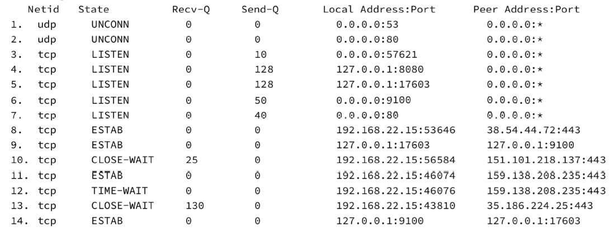

# 1

## a)Liste los registros DNS que deberia tener configurado ns1 para cumplir con los requisitos
"ns1 brinda respuesta autoritativa para el dominio redes.edu.ar"

<!-- el registro ns y soa va a estar en la autoridad padre? -->
Registros de ns1:
| name                        | ttl  | class | type  | data              |
| --------------------------- | ---- | ----- | ----- | ----------------- |
| redes.edu.ar                | 1000 | IN    | A     | 198.51.100.196    |
| redes.edu.ar                | 1000 | IN    | A     | 203.0.113.68      |
| www.redes.edu.ar            | 1000 | IN    | CNAME | redes.edu.ar      |
| sedeprincipal.redes.edu.ar  | 1000 | IN    | CNAME | redes.edu.ar      |
| sedesecundaria.redes.edu.ar | 1000 | IN    | CNAME | redes.edu.ar      |
| redes.edu.ar                | 1000 | IN    | MX    | mail.redes.edu.ar |
| mail.redes.edu.ar           | 1000 | IN    | A     | 198.51.100.194    |
| ftp.redes.edu.ar            | 1000 | IN    | A     | 203.0.113.69      |
| sharedfolder.redes.edu.ar   | 1000 | IN    | CNAME | ftp.redes.edu.ar  |

El servidor de DNS se implementaria con Round Robin para el balanceo de cargas.

## b) Se desea configurar un nuevo host en la red de usuarios de Sede Principal. Indique todos los valores de red que el tecnico de la red deberia configurar para que el host pueda conectarse a internet y a los recursos de la organizacion.

Se debería configurar la tabla de ruteo del nuevo host de la siguiente forma:

| Destino     | Mask | Next-hop    | Iface |
| ----------- | ---- | ----------- | ----- |
| 192.0.2.128 | /25  | -           | eth1  |
| 0           | /0   | 192.0.2.129 | eth1  |

## c) Si un usuario en PC-C ingresa mediante su navegador a http://www.redes.edu.ar, ¿es posible determinar a que host llegará esa solicitud?
No es posible previamente saber a que host llegará esa solicitud. Ya que al consultar por el nombre www.redes.edu.ar, la ip que devolvería el servidor dns varía entre las 2 posibles por el Round Robin load balancer.

## d) Cuándo cualquiera de los hosts "www" recibe una solicitud, ¿Que caracteristica del protocolo en cuestion permite determinar que sitio dentro de los que se aloja debe presentar al cliente?
Lo determina el header "host" enviado en la peticion del protocolo http version 1.1.
En el caso de http2, lo determina el pseudo-header ":authority:"

# 2
Dada la siguiente salida del comando ss-nltu en el host A:

## A) Puede determinar y listar las direcciones IP que tiene asignadas host A?
La única direccion que tiene asignada el host A es 192.168.22.15.

La direcion 127.0.0.1 es parte del rango de direcciones de loopback

<!-- duda: que representa 0.0.0.0? un ip  comodin/default? -->

## B ¿A que fase de la conexion se corresponde el estado de la linea 12? Independientemente de quien inicia esta fase, brinde dos posibles intercambios de mensajes posibles asociados.
