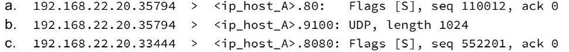
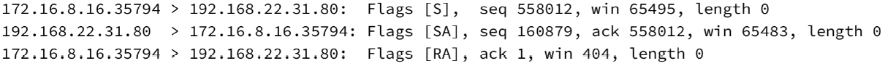
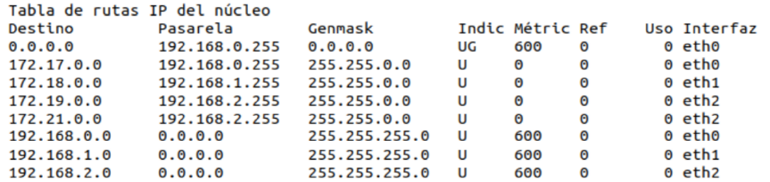
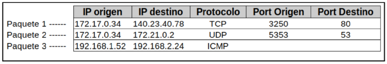

    
# 1

## a)Liste los registros DNS que deberia tener configurado ns1 para cumplir con los requisitos
"ns1 brinda respuesta autoritativa para el dominio redes.edu.ar"

<!-- el registro ns y soa va a estar en la autoridad padre? si y tmb en los autoritativos-->
Registros de ns1:
| name                        | ttl  | class | type  | data              |
| --------------------------- | ---- | ----- | ----- | ----------------- |
| www.redes.edu.ar            | 1000 | IN    | A     | 198.51.100.196    |
| www.redes.edu.ar            | 1000 | IN    | A     | 203.0.113.68      |
| sedeprincipal.redes.edu.ar  | 1000 | IN    | CNAME | www.redes.edu.ar  |
| sedesecundaria.redes.edu.ar | 1000 | IN    | CNAME | www.redes.edu.ar  |
| redes.edu.ar                | 1000 | IN    | MX    | mail.redes.edu.ar | <!-- no va porque es solo para enviar --> |
| mail.redes.edu.ar           | 1000 | IN    | A     | 198.51.100.194    |
| ftp.redes.edu.ar            | 1000 | IN    | A     | 203.0.113.69      |
| sharedfolder.redes.edu.ar   | 1000 | IN    | CNAME | ftp.redes.edu.ar  |

El servidor de DNS se implementaria con Round Robin para el balanceo de cargas.

## b) Se desea configurar un nuevo host en la red de usuarios de Sede Principal. Indique todos los valores de red que el tecnico de la red deberia configurar para que el host pueda conectarse a internet y a los recursos de la organizacion.

Se debería configurar la tabla de ruteo del nuevo host de la siguiente forma:

| Destino     | Mask | Next-hop    | Iface |
| ----------- | ---- | ----------- | ----- |
| 192.0.2.128 | /25  | -           | eth1  |
| 0           | /0   | 192.0.2.129 | eth1  |

## c) Si un usuario en PC-C ingresa mediante su navegador a http://www.redes.edu.ar, ¿es posible determinar a que host llegará esa solicitud?
No es posible previamente saber a que host llegará esa solicitud. Ya que al consultar por el nombre www.redes.edu.ar, la ip que devolvería el servidor dns varía entre las 2 posibles por el Round Robin load balancer.

## d) Cuándo cualquiera de los hosts "www" recibe una solicitud, ¿Que caracteristica del protocolo en cuestion permite determinar que sitio dentro de los que se aloja debe presentar al cliente?
Lo determina el header "host" enviado en la peticion del protocolo http version 1.1.
En el caso de http2, lo determina el pseudo-header ":authority:"

# 2
Dada la siguiente salida del comando ss-nltu en el host A:

## A) Puede determinar y listar las direcciones IP que tiene asignadas host A?
La única direccion que tiene asignada el host A es 192.168.22.15.

La direcion 127.0.0.1 es parte del rango de direcciones de loopback

<!-- duda: que representa 0.0.0.0? un ip  comodin/default? -->
<!-- https://askubuntu.com/questions/1370548/whats-the-difference-between-address-0-0-0-0-and -->
## B) ¿A que fase de la conexion se corresponde el estado de la linea 12? Independientemente de quien inicia esta fase, brinde dos posibles intercambios de mensajes posibles asociados.

Se corresponde a la fase de finalizacion de conexión.
<!-- todo: brinde dos posibles intercambios de mensajes posibles asociados-->

## C) Indique como se veria con TCPDUMP la respuesta a los siguientes paquetes observados en el host A(incluya toda la informacion posible: direcciones IP, puertos, flags y num de seq y confirmacion)

- a) 192.168.22.15.80 > 192.168.22.20.35794: Flags [SA], seq 12345, ack 110013
- b) No necesariamente habría una respuesta a este paquete ya que es UDP, es decision de la capa de aplicación si enviar o no una respuesta.
- c) 192.168.22.15.8080 > 192.168.22.20.33444: Flags[SA] seq 12345, ack 552202

# 3
Un usuario indica que utilizando un navegador accede a www.redes.edu/hola.txt y tiene problemas para visualizar el recurso solicitado. Usted se conecta al servidor y obtiene la siguiente captura de trafico:

## a) ¿En que protocolo ubicaría el problema? ¿ el problema esta en el cliente o servidor?
En el protocolo TCP,  ya que el host con ip 192.168.22.31 responde con un ack 558012 cuándo debería responder con ack 558012, eso es lo que posiblemente produzca que el cliente responda al servidor con un RESET ACK.
El problema por lo tanto, está en el servidor
## b) ¿Que datos del protocolo HTTP llegaron a ser intercambiados?

# 4 
Utilizando CIDR, indique cuales de los siguientes bloques pueden ser agrupados y determine el bloque CIDR resultante de dicha sumarización: 113.33.215.0/24, 113.33.216.0/24, 113.33.217.0/24 y 113.33.218.0/23
<!--  -->
215 = 11010111|
216 = 11011000|
217 = 11011001|
218 = 1101101|0 esta sumarizando 2 redes /24 (18 y 19)

Unicamente pueden ser sumarizados 113.33.216.0/24 y 113.33.217.0/24 en 113.33.216.0/23
<!-- la mascara debía ser igual, no? si hubiera sido 113.33.216.0/23 no sería posible, no? -->

se sumariza 216 con 217, y despues ese /23 se sumariza con el 218 que tambien es /23

queda 113,33.126.0/22
# 5 
Utilizando el prefijo de red 13.14.56.0/23 asigne direcciones ip a las siguientes subredes: A(117),B(97),C(192)
<!-- todo -->

# 6 
Indique todas las direcciones IPv6 con las que se autoconfigurará una PC usando EUI-64 considerando que:
Tiene la direccion MAC 3c:e5:8d:96:9a:b5. Está conectada a un segmento de red en el que se recibe un router Advertisement del prefijo 2900:aabb::/64

<!-- todo -->
<!-- deberia tener 2 IPv6, no? -->

# 7
Dada la siguiente tabla de rutas:

Indique por cual interfaz se enviarán los siguientes paquetes y en cada uno, la direccion MAC de destino que tendría que usar (suponga que la conoce)

| Paquete   | interfaz | MAC-destino            |
| --------- | -------- | ---------------------- |
| paquete 1 | eth0     | <mac-de-192.168.0.255> |
| paquete 2 | eth2     | <mac-de-192.168.2.255> |
| paquete 3 | eth2     | <!-- cual es?? -->     |

# 8

Considerando la siguiente topología y luego de que pc-A hace un ping exitoso a pc-C

## A) Complete la informacion del ARP request que realiza pc-A. Incluya la informacion de los protocolos ethernet y ARP.
pca envia arp request a switch1. switch 1 guarda q la mac a esta en e0. Como hace broadcast switch 2 tmb guarda la mac de a en e1
vuelve arp reply de routerA a host a (unicast). switch ya sabe a que puerto mandar la info porque lo aprendio del request pasado. Switch 1 se va a guardar la mac del routerA
Ahora sale el mensaje icmp que va al router A.
Llega icmp al routerA, desarma la trama, mira su tabla de ruteo, ve que tiene que mandar por eth1.
Hace arp request y el switch3 guarda la mac de esa interfaz del ruter, pcC le responde con arp response y el switch tmb se guarda esa mac
Cuando llega el arp response, el router manda el icmp a pcC.

En la tabla arm de cada router y pc, se va guardando el resultado de cada arp en las tablas arp 

## B) Indique como quedan las tablas CAM de los dispositivos que están en el mismo segmento de broadcast que pc-A

## C) Si en pc-B hubiesen estado capturando tráfico en la interfaz eth0, ¿que hubiesen escuchado? Para cada paquete capturado, indique el protocolo y si se trata de un requerimiento o respuesta.
<!-- todo: -->

<!-- tabla cam asocia mac con puerto switch

tabla arp asocia ip con mac y esta en las pc y routers -->