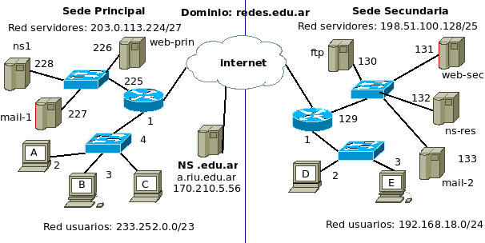
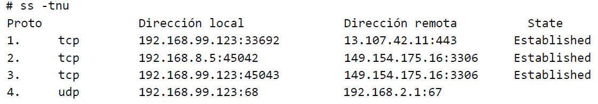
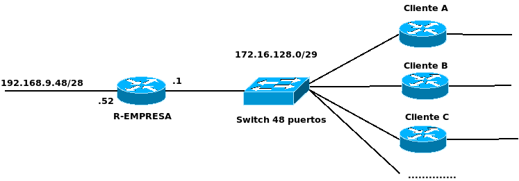

# 1. La persona encargada de la organización redes.edu.ar requiere de su servicio de consultoría. Además, le presenta una explicación con el siguiente diagrama:

Considerar sobre los DNS servers:
- ns1: servidor autoritativo para redes.edu.ar
- ns-res: servidor resolver interno.
- a.riu.edu.ar: server autoritativo de la zona edu.ar
- 
Considerar sobre web servers:
- web-prin: tiene definido 2 sitios web.
wp1.redes.edu.ar y wp2.redes.edu.ar.

## a) Su primera tarea es asistir en la migración del servidor web principal con una nueva dirección IP: 203.0.113.229. Se le pide encontrar una manera en la que pueda ayudar a reducir el tiempo de propagación a 1 hora luego de que se efectivice la modificación de los registros DNS afectados. 
Indique qué solución propone, en cúal/cuáles servidores realizaría el cambio y para cada uno la configuración completa de los registros afectados.

Modificaría los siguientes registros del servidor dns autoritativo ns1.redes.edu.ar: 
- registro "A" asociado a web-prin.redes.edu.ar, modificaría su adress a 203.0.113.229:
  - wp1.redes.edu.ar A 203.0.113.229
  - wp2.redes.edu.ar CNAME wp1.redes.edu.ar
- para el tiempo de propagación, modificaría con antelación el campo de refresh time del registro "SOA" a "3600" y el campo "Minimum TTL" a "3600", de esta forma los servidores autoritativos secundarios tendran sus registros actualizados con el servidor primario al menos cada una hora, y los registros tendrán un default ttl de 1 hora.

## b) El administrador capturó tráfico HTTP en web-prin y observó que los recursos solicitados por un user-agent fueron respondidos en orden, secuencialmente durante una misma conexión TCP. Indique qué versión HTTP capturó y cuál es la característica de HTTP observada.

Es Http versión 1.1 porque usa una misma conexión tcp, entonces no puede der http 1.0. Cómo fue respondido secuencialmente y en orden, no puede der http 2, ya que la versión 2 responde en forma paralela, no secuencial.

## c) Se le indica instalar un servidor de correo completo para los usuarios de ambas sedes en mail-1. Además instalar mail-2 para que en caso de que mail-1 deje de prestar servicio no se pierdan correos entrantes. El único requisito es que se utilicen los menores recursos de hardware posible. 
Indique qué protocolos configurará en cada servidor y adicionalmente incluya los registros DNS que intervienen en la solución.

En mail-1 implementaría un servidor de correo con POP y SMTP. Elijo POP ya que es un protocolo liviano para que los usuarios puedan acceder a sus correos. El protocolo SMTP se encargará de enviar los correos del servidor a los destinatarios  y recibir correos de otros MTA y de mail-2 (en caso de que mail-1 se haya caído y durante el transcurso de esa caída se hayan recibido correos en mail-2)

En el mail-2 implementaría implementaría un servidor de correo con únicamente SMTP, que permitirá que se puedan recibir correos desde el mta de otras areas en el caso de que se caiga el servidor mail-1. 

Registros dns agregados en el servidor primario ns1.redes.edu.ar:

redes.edu.ar MX 1 mail-1.redes.edu.ar
redes.edu.ar MX 1 mail-2.redes.edu.ar
mail-1.redes.edu.ar A 203.0.113.227
mail-2.redes.edu.ar A 198.51.100.133

## d) El usuario de PC-D al conectarse al servicio ftp.redes.edu.ar logra ejecutar comandos pero falla al solicitar la descarga de un archivo. Previamente comprobó que el servicio FTP está debidamente configurado y que el usuario de PC-E puede utilizar el servicio sin problemas. Indique qué ocasiona el problema de PC-D y cómo solucionarlo de la manera más sencilla.

Un problema posible es que la PC-D se encuentra en una red privada (ya que su ip está en el rango de ip privadas que comienzan con 192.168...) y se esté conectando en modo Activo al servidor FTP. Al conectarse en modo Activo, puede haber conflictos con la posible configuración NAT que tenga el router conectado a esa red privada, ya que es el servidor FTP el que se conecta a un puerto del Cliente y se debería tener habilitado el Port Forwarding para ese caso. Una forma sencilla de solucionarlo es que la PC-D se conecte en modo pasivo así como debe estár conectada la PC-E que no tiene problemas.

# 2 Dada la siguiente información obtenida del host Z

# a) Entrada 1: El host 192.168.99.123 envió varios ACK indicando win=0. ¿Qué está indicando?
Significa que el buffer del socket correspondiente a ese host está lleno y no puede recibir mas datos hasta que vuelva a tener espacio libre.

# b) Entrada 2 y 3, ¿podría el host Z establecer una nueva conexión dados los siguientes parámetros?:
- 192.168.8.5:45043 > 149.154.175.16:3306 Flags[S] , seq 100

Si podría, ya que no hay ninguna conexión tcp con entre ese host con ip 192.168.8.5, puerto 45043 con el otro host de ip 149.154.175.16 y puerto 3306

# c) Entrada 4: se pierde el quinto mensaje enviado desde el comienzo de la comunicación. ¿Qué acción tomará el protocolo con ese mensaje?.

Al ser protocolo udp, el protocolo no tomará ninguna acción por esa pérdida de mensaje.

# 3. Dados los siguientes paquetes obtenidos de una captura, indique cuál sería el datagrama/segmento previo a cada uno de ellos (incluya toda la información posible: protocolo, direcciones IP, puertos, flags y números de secuencia y confirmación):
## a. 192.168.8.15.9999 > 192.168.8.253.16367: Flags [RA], seq 0, ack 3230256111, win 0, length 0
## b. 127.0.0.1.1918 > 127.0.0.1.9050: Flags [A], seq 1, ack 1, win 65495, length 0
## c.  IP 192.168.8.15 > 192.168.8.253: ICMP 192.168.8.15 port 9 unreachable, length 36

a) 192.168.8.253.16367 > 192.168.8.15.9999: Flags [S], seq 3230256110, win 512, length 0
b) 127.0.0.1.9050 > 127.0.0.1.1918: Flags [SA], seq 0, ack 1, win 512, length 0
c) 192.168.8.253:9999 > 192.168.8.15:9: UDP length 36

# 4. Una empresa provee un servicio de interconexión para que sus clientes puedan conectarse directamente a una red privada mediante un switch de alta velocidad, sin pasar por internet. Al momento sólo obtuvieron 3 clientes: cliente A (18 hosts), cliente B (13 hosts), cliente C (15 hosts).

## a) ¿Cuál es la capacidad máxima de clientes?
2^3 = 8. 8-2 = 6
6 clientes es la capacidad máxima.
<!-- creo q esta mal porque hay q restar 1 mas por la ip asignada al router -->

## b) Utilice la red 192.168.12.128/25 para asignar una subred a los clientes A, B y C desperdiciando la menor cantidad de direcciones.
192.168.12.128/25 = 192.168.12.1|0000000

Primero asigno red a cliente A. Necesito 5 bits de hosts para los 18 hosts.
Subneteo la red 192.168.12.128/25 en 4 subredes /27
192.168.12.1|00|00000
192.168.12.1|01|00000
192.168.12.1|10|00000
192.168.12.1|11|00000

Le asigno la primera subred 192.168.12.128/27 al cliente A.

Contunuo con el cliente C, que necesita 5 bits de hosts para los 15 hosts.
Uso la segunda red generada anteriormente:
192.168.12.160/27

Continuo con el cliente B, que necesita 4 bits de hosts para 13 hosts.
Subneteo la tercera red generada 192.168.12.192/27 en 2 subredes /28
192.168.12.110|0|0000 = 192.168.12.192/28
192.168.12.110|1|0000 = 192.168.12.208/28

Le asigno al cliente B la subred 192.168.12.192/28.

Redes asignadas a clientes:
192.168.12.128/27 al cliente A
192.168.12.160/27 al cliente C
192.168.12.192/28 al cliente B

## c) ¿Es posible aplicar CIDR en la tabla de ruteo de R-EMPRESA?.

192.168.12.128/27 = 192.168.12.100|00000
192.168.12.160/27 = 192.168.12.101|00000

Si, es posible aplicar CIDR a las subredes 192.168.12.128/27 y 192.168.12.160/27, sumarizandolas a 192.168.12.160/28
<!-- MAL! EL NEXT HOP ES DISTINTO!! NO ES POSIBLE!!! -->

6. Los siguientes argumentos son FALSOS, explique de manera concisa por qué (no más de 3 líneas). Debe abordar todos los
conceptos que se mencionan en cada una.
a) Para ciertos casos en redes inalámbricas el protocolo Ethernet considera el uso de 3 o hasta 4 direcciones mac.

b) En una red IPv6, las tramas Ethernet utilizan direcciones de 64 bits que se extienden utilizando el método EUI64.
utiliza direcciones mac

c) Una tabla ARP tiene entradas de sólo un segmento de broadcast.

d) El tamaño máximo de una trama está dado por el MSS, generalmente tiene un valor de 1500.
El tamaño maxomo de la trama lo da el protocolo de enlace

