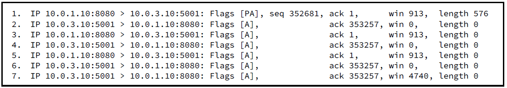
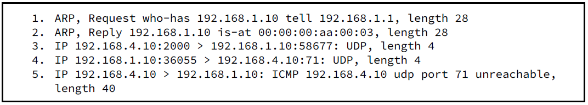
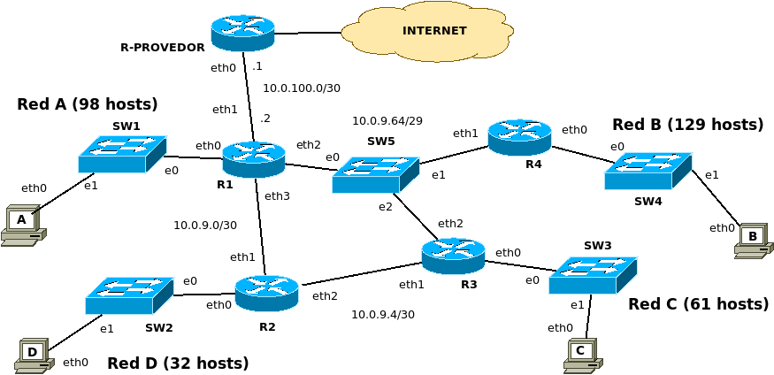

# 1
En un escenario donde se envió un correo desde la cuenta docente@redes.edu.ar a alumno@gmail.com, responda las siguientes consultas, teniendo en cuenta que se obtiene solamente con la información que se muestra en la tabla:


## ● ¿Qué host/s y en qué paso consultaron algunos de los MX de los dominios para establecer una comunicación?
Cuándo el MUA de docente@redes.edu.ar le envía el correo a su MTA, el MUA hace una consulta dns preguntando por el registro "A" de su servidor smtp, el cuál asumo que es mail.linti.edu.ar, para obtener la direccion IP y poder mandarle el correo.
Cuando el correo le llegue al MTA servidor smtp "mail.linti.edu.ar", éste hará una consulta dns a preguntando por el registro "mx" de "gmail.com". También necesitara el registro "A" correspondiente, para obtener la IP de un servidor smtp de alumno@gmail.com
## ● En función de la respuesta obtenida ¿tiene toda la información necesaria para establecer la comunicación?
No, falta la ip de los servidores smtp. Esta se obtiene a partir de los registos "A" del servidor dns del dominio "gmail.com"

# 2
Se tiene la siguiente salida del comando curl. A continuación se limpian las cachés y se accede a la misma URL desde un navegador web, se captura tráfico con Wireshark en la misma PC hasta la visualización completa del sitio.
Describa, en forma secuencial, qué tráfico relacionado con esta acción encontrará en la captura, detallando para cada protocolo los campos solicitados según aplique:
```
$ curl -I http://mail.redes.unlp.edu.ar
HTTP/1.0 302 Moved Temporarily
Location: https://mail.info.unlp.edu.ar
Server: BigIP
Connection: Keep-Alive
Content-Length: 0
```

<!-- rta -->
Se realizara:
1. escribe una query dns preguntando por el registro A de mail.redes.unlp.edu.ar
2. lo encapsual en segmento udp
3. encapsula el segmento udp en datagrama ip
4. encapsula datagrama ip en trama ethernet
5. ve que no conoce la mac adress de su servidor dns (o router default si no es parte de su red)
6. hace arp request a su servidor dns (o router default)
7. recibe arp reply
8. envía la trama ethernet cuyo contenido final tiene la query dns recursiva, ya que ahora conoce su mac que le faltaba.
9. el servidor dns le responde con el registro A que solicitó
10. la PC recibe la respuesta dns
11. la pc envía la solicitud http a la ip que le devolvió el servidor dns
12. (si el servidor dns estaba dentro de su red, vuelve a hacer una consulta arp para preguntar esta vez por mac del router)
13. la pc recibe la respuesta del servidor http


<!-- 

se manda en orden:
- arp Request
- arp response
- dns query
- arp request por 
- http query

si el servidor dns estuviera adentro, se hace 2 veces la consulta arp, si esta afuera, solo 1


tip: las mac cambian en cada dominio de broadcast en la consulta arp

 -->


<!--es viejo y malo esto de abajo-->
9. Request HTTP para obtener sólo los headers que se retornarian si solicitara el recurso mediante un get
10. DNS query para obtener la ip del servidor donde se encuentra hosteada mail.redes.unlp.edu.ar
11. Se realiza el envio del segmento que contiene la query DNS al Servidor Local DNS encapsulado en un **segmento udp**
12. El segmento udp se encapsula en un **datagrama IP**
13. El datagrama IP se encapsula en una **trama Ethernet**
14. 


## a) DNS (query / response, tipo registro, nombre registro, valor) 
query: 
    - tipo-registro: A 
    - nombre-registro: mail.redes.unlp.edu.ar 
response:
    - tipo-registro: A 
    - nombre-registro: mail.redes.unlp.edu.ar 
    - valor: 192.168.2.2
## b) HTTP (línea de requerimiento)
GET / HTTP/1.1

## c) ARP (request / reply, mac origen, mac destino) 
(suponiendo que el servidor dns local está en otra red)
arp request1:
    mac-origen: <mac-de-pc>
    mac-destino: 00:00:00:00:00:00
arp reply1:
    mac-origen: <mac-de-router>
    mac-destino: <mac-de-pc>

## d) IMAP (ip origen / ip destino)
No se utiliza el protocolo IMAP


# 3.
Teniendo en cuenta la siguientes consideraciones en conjunto con la captura TCP que se muestra, responder:
● Al host A 10.0.1.10 aún le quedan 372 bytes por enviar y luego iniciará el cierre de la comunicación.
● Al host B 10.0.3.10 no le quedan datos por enviar.



## a) ¿Cuál es el diagnóstico de lo que está sucediendo?
El buffer del socket TCP del host B está lleno, por lo que el host B le manda un tamaño de ventana de 0 para avisar que no puede almacenar los datos que el host A le envie.
Recién en la última línea el host B incrementa el tamaño de ventana a 4740, por lo que el aparente problema está solucionado.
## b) ¿Podrá el host 10.0.1.10 enviar los datos faltantes? En tal caso indique las líneas faltantes a la comunicación hasta su cierre siguiendo el esquema de campos que tiene la captura.
Sí, podrá enviar los datos faltantes ya que el tamaño de ventana es de 4740.

| 7.  | IP 10.0.3.10:5001 > 10.0.1.10:8080 | Flags [A]  | --         | ack:353257 | win:4740 | length:0   |
| --- | ---------------------------------- | ---------- | ---------- | ---------- | -------- | ---------- |
| 8.  | 10.0.1.10:8080 > 10.0.3.10:5001    | Flags [A]  | seq:353257 | ack:1      | win:913  | length:372 |
| 9.  | IP 10.0.3.10:5001 > 10.0.1.10:8080 | Flags [A]  | seq:1      | ack:353629 | win:4368 | length:0   |
| 10. | 10.0.1.10:8080 > 10.0.3.10:5001    | Flags [FA] | seq:353629 | ack:1      | win:913  | length:0   |
| 11. | IP 10.0.3.10:5001 > 10.0.1.10:8080 | Flags [FA] | seq:1      | ack:353630 | win:4368 | length:0   |
| 12. | 10.0.1.10:8080 > 10.0.3.10:5001    | Flags [A]  | seq:353630 | ack:2      | win:913  | length:0   |


# 4.
Responda basándose en la siguiente captura:



## a) Indique qué desencadenó y para qué se utilizó el intercambio ARP (observar todo el intercambio).
<!-- 
    respondido en consulta practica: El arp request lo realizó un router para obtener el mac adress de 192.168.1.10, para que luego en la linea 3 y 4 se envien paquetes a esa ip

 -->

El intercambio ARP se utilizó para obtener la mac adress de la interfaz correspondiente a la ip 192.168.1.10,<!-- no hay q ser tan especifico -->
<!-- duda: están en la misma red, ¿no? ¿sino le hubiera opreguntado a otra ip? -->
Esto desencadenó que 192.168.4.10 ahora sepa la mac adress a la cual tenga que mandar la trama Ethernet. También hará que se actualize la tabla CAM de cualquier switch con el mac_origen de la trama ethernet que atraviese dicho switch.

## b) Mencionar tres posibles eventos por los cuales el emisor, 192.168.4.10, no recibirá ninguna respuesta por parte del receptor para el mensaje de la tercera línea.
- No hay ningún socket udp escuchando en el puerto 58677<!-- mal, no? porque habria un icmp como respuesta -->
- El mensaje llegó correctamente y el receptor no tiene ningun mensaje para enviarle
- El mensaje llegó correctamente, el receptor le envía un mensaje y, por colapso de la red, no le llega al emisor inicial
- El mensaje llegó correctamente, el receptor le envía un mensaje y, por mala configuración de un router, no le llega al emisor inicial.

## c) ¿Con qué evento de la captura está relacionado el quinto mensaje y cómo se interpreta?
Esta relacionado con el evento de la linea 4.
Se interpreta como que el host 192.168.1.10 no tiene ningun socket udp escuchando en el puerto 71.

# Tenga presente la topología para los siguientes ejercicios.



● El tráfico entre Red B-Red C y Red B-Red D pasa por R3. En cualquier otro caso, la estrategía es
la elección de la ruta con menos saltos.
● El Router R2 solo tiene rutas hacia las redes internas (Red A, B, C y D).
● Todas las redes, a excepción de Red D, salen a Internet.

# 5.
Segmentación de la topología y asignación de direcciones.

## a) Utilice la red 212.252.0.0/23 para segmentar la red desperdiciando la menor cantidad de direcciones IP posible.

212.252.0.0/23 = 212.252.0000000|0.00000000

Red B necesita direcciones para 129 hosts: 8 bits de hosts
Entonces subneteo 212.252.0.0/23 en 2 subredes /24:
212.252.0.0/24
212.252.1.0/24

Le asigno la subred 212.252.0.0/23 a la Red B.

Red A necesita direcciones para 98 hosts: 7 bits de hosts.
Entonces subneteo 212.252.1.0/24 en 2 subredes /25:
212.252.1.0/25
212.252.1.128/25

Le asigno la subred 212.252.1.0/25 a la red A.

Red C necesita direcciones para 61 hosts: 6 bits de hosts
Entonces subneteo 212.252.1.128/25 en 2 subredes /26: 
212.252.1.128/26
212.252.1.192/26

Le asigno la subred 212.252.1.128/26 a la red C.

La red D necesita direcciones para 32 hosts: 6 bits de hosts
Le asigno la subred generada anteriormente 212.252.1.192/26 a la red C.

Asignaciones: 

- 212.252.0.0/24 a la Red B
- 212.252.1.0/25 a la red A
- 212.252.1.128/26 a la red C
- 212.252.1.192/26 a la red D


## b) Realice la asignación de direcciones IP a toda la topología con las redes obtenidas en el punto anterior y a las interfaces de los routers faltantes

eth0_R4: 212.252.0.1/24
eth0_PC-B: 212.252.0.2/24
resto de hosts:212.252.0.3 a 212.252.0.129

eth0_R1: 212.252.1.1/25
eth0_PC-A: 212.252.1.2/25
resto de hosts:212.252.1.3 a 212.252.1.98

eth0_R3: 212.252.1.129/26
eth0_PC-C: 212.252.1.130/26
resto de hosts:212.252.1.131 a 212.252.1.189

eth0_R2: 212.252.1.193/26
eth0_PC-D: 212.252.1.194/26
resto de hosts:212.252.1.195 a 212.252.1.224

eth1_R4: 10.0.9.65
eth2_R1: 10.0.9.66
eth2_R3: 10.0.9.67

eth3_R1: 10.0.9.1
eth1_R2: 10.0.9.2

eth2_R2: 10.0.9.5
eth1_R3: 10.0.9.6

# 6.
Armar la tabla de ruteo del router R4 de la topología. Utilice sumarización siempre que sea posible.

| Destino       | mascara | next-hop  | iface |
| ------------- | ------- | --------- | ----- |
| 0.0.0.0       | /0      | 10.0.9.66 | eth1  |
| 212.252.0.0   | /24     | -         | eth0  |
| 10.0.9.64     | /29     | -         | eth1  |              |
| 212.252.1.128 | /26     | 10.0.9.67 | eth1  | red c (a R3) |
| 212.252.1.192 | /26     | 10.0.9.67 | eth1  | red d (a R3) |
| 212.252.1.0   | /25     | 10.0.9.66 | eth1  | red a (a R1) |
| 10.0.9.0      | /30     | 10.0.9.66 | eth1  | (a R1)       |
| 10.0.9.4      | /30     | 10.0.9.67 | eth1  | (a R3)       |
| 10.0.100.0    | /30     | 10.0.9.66 | eth1  | (a R1)       |

puedo sumarizar:
- 212.252.1.128/26 212.252.1.192/26 en 212.252.1.128/25
  <!-- tengo que volver a escribir la tabla?? -->

# 7.
¿Cómo quedarían las tablas de Switch 1 y Switch 5 luego de cada uno de los siguientes eventos? No
considerar el Intercambio de mensajes adicionales al indicado y tener en cuenta el ruteo del punto anterior .

<!-- Duda: hay q justificar??? que tanto justificar?? -->
## a) PC-A envía un segmento TCP con el flag SYN activo a PC-C.
PC-A hace ARP request desde eth0_PC-a por la ip de eth0_R1 
Desde eth0_R1 le hace ARP reply

Switch 1:
- e0: <mac_eth0_R1>
- e1: <mac_eth0_PC-A>

Switch 5:
- e0: <mac_eth2_R1>
- e2: <mac_eth2_R3>

## b) PC-B envía un paquete IP con TTL 2 a PC-A.
<!-- interesante  -->
por el ttl 2 llega hasta PC-A (justo)

Switch 1:
- e0: <mac_eth0_R1>
- e1: <mac_eth0_PC-A>

Switch 5:
- e0: <mac_eth2_R1>
- e2: <mac_eth2_R3>
- e1: <mac_eth1_R4>


## c) PC-C envía un segmento TCP con los flags Reset y ACK activos a PC-A
(no hay modificaciones)
Switch 1:
- e0: <mac_eth0_R1>
- e1: <mac_eth0_PC-A>

Switch 5:
- e0: <mac_eth2_R1>
- e2: <mac_eth2_R3>
- e1: <mac_eth1_R4>

## d) PC-D envía un ICMP (Echo Request) a PC-C.
(no hay modificaciones)
Switch 1:
- e0: <mac_eth0_R1>
- e1: <mac_eth0_PC-A>

Switch 5:
- e0: <mac_eth2_R1>
- e2: <mac_eth2_R3>
- e1: <mac_eth1_R4>