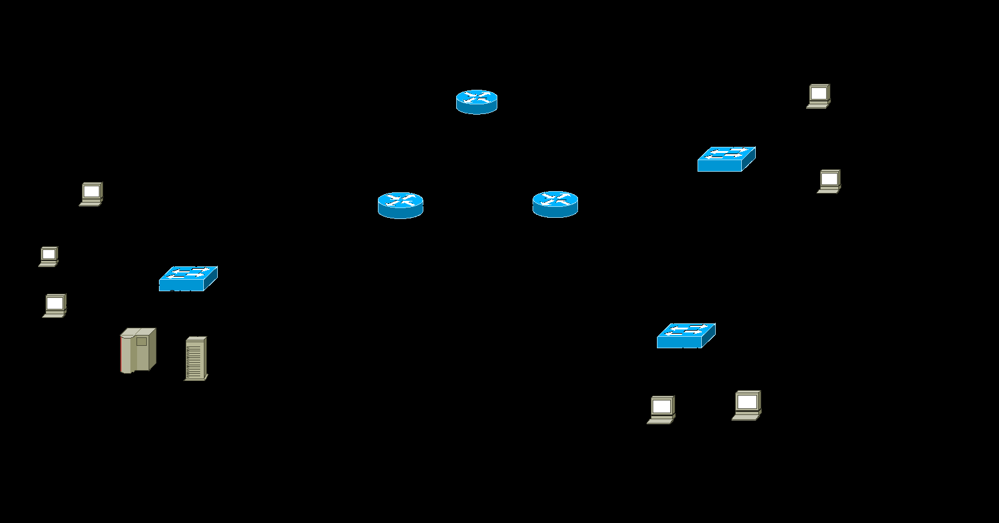
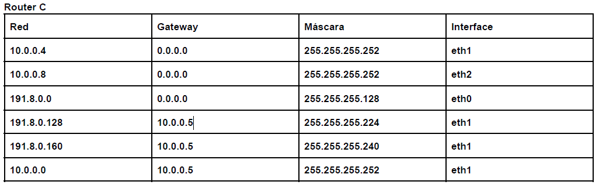

# 1) En base a la siguiente topología y la tabla de ruteo del router C, responder:

1. IP 191.8.0.5:2323 > 191.8.0.35:80: Flags [S], seq 1363516609, win 512, length 0
2. IP 191.8.0.35:80 > 191.8.0.5:2323: Flags [SA], seq 2407054621, ack 1363516610 win 6240, length 0
3. IP 191.8.0.165:2836 > 191.8.0.35:80: Flags [S], seq 1273089217, win 512, length 0
4. IP 191.8.0.35:80 > 191.8.0.165:2836: Flags [SA], seq 1949827, ack 127308218 win 6240, length 0
5. IP 10.0.0.5 > 191.8.0.35: ICMP net 191.8.0.165 unreachable

## a) Avisan de un problema de acceso entre los dispositivos y contamos la captura de tráfico realizada en el Web Server. Asumiendo que las IP están correctamente asignadas en los dispositivos de toda la topología, indique qué problemas podrían estar ocurriendo y cuáles serían las soluciones posibles. 
<!-- https://learningnetwork.cisco.com/s/question/0D53i00000Z8FRvCAN/icmp-network-unreachable-vs-host-unreachable -->

<!-- la captura es desde 191.8.0.5?? -->
<!--duda: la linea 5 es la unica relevante?? -->

Es posible es que en la tabla de ruteo del Router A no se encuentre ninguna entrada con destino a la red 191.8.0.160 y que tampoco tenga default gateway.

Una solución posible a ese problema es agregar la siguiente entrada a la tabla de ruteo del Router A:
- Destino: 191.8.0.160
- Mascara: /28
- Interfaz: eth0
- Next-hop: 10.0.0.2

otra solución posible es modificar la entrada del router A:
- Destino: 191.8.0.160
- Mascara: /28
- Interfaz: eth2
- Next-hop: 10.0.0.10

## b) Asumiendo que la red está funcionando correctamente, sin tener en cuenta lo evaluado en el punto a, indique de qué forma se podría reducir la tabla de ruteo del router C que se visualiza manteniendo el acceso a todas las redes.

191.8.0.128/27 = 191.8.0.100|00000
191.8.0.160/28 = 191.8.0.1010|0000

## c) La empresa decidió migrar únicamente los servidores de la Red C a una nueva red, Red D, conectada al router B usando alguna de las redes disponibles teniendo en cuenta que la dirección inicial a partir de la cual se realizó el subnetting es 191.8.0.0/23. Se debe asignar una de las redes libres de forma que se pueda aplicar CIDR en el router A desperdiciando la menor cantidad posible de direcciones y con la capacidad de asignar direcciónes IPs como máximo a 14 hosts.

### i) Indique la dirección de red que se asignará detallando el desarrollo para su obtención.

### ii) Realice tabla de ruteo del router A de forma que se pueda acceder a todas las redes por el camino más corto, indicando las redes que se simplificaron.

# 2) ¿Cómo quedaría la tabla CAM del switch S_red_C luego del intercambio de la captura del webserver? (solo tener en cuenta los mensajes que se muestran en la captura)

# 3) Se desea agregar un servicio de mail para los usuarios de todas las redes. Para asegurarse un buen servicio se agregarán 2 servidores de mail.

##  a) Indique todos los registros que se deberán agregar en el servidor de DNS teniendo en cuenta que el dominio es campeones.com y los servidores mailreda.campeones.com (principal) se encuentra en la red D y alt1.mailreda.campeones.com (secundario) en la red A. 

## b) Al momento que el cliente desea recibir sus mails el servicio deberá cumplir con los siguientes requisitos: no guardar copia de los mails en el servidor por defecto, permitir enviar correos cifrados. Indique cuál es el protocolo elegido.

# 4) Teniendo en cuenta la tabla de ruteo y captura que se muestran en el punto 1, y asumiendo que desde el router B se accede a la Red C por router C, indique qué evento/s de la captura producirán tráfico ARP entre los routers B y C y cuáles serían los ARP Request (indicar datos de Ethernet y ARP) enviados.