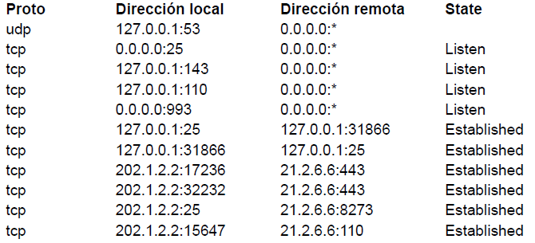

# 1) En base a la siguiente topología y la tabla de ruteo del router C, responder:

1. IP 191.8.0.5:2323 > 191.8.0.35:80: Flags [S], seq 1363516609, win 512, length 0
2. IP 191.8.0.35:80 > 191.8.0.5:2323: Flags [SA], seq 2407054621, ack 1363516610 win 6240, length 0
3. IP 191.8.0.165:2836 > 191.8.0.35:80: Flags [S], seq 1273089217, win 512, length 0
4. IP 191.8.0.35:80 > 191.8.0.165:2836: Flags [SA], seq 1949827, ack 127308218 win 6240, length 0
5. IP 10.0.0.5 > 191.8.0.35: ICMP net 191.8.0.165 unreachable

## a) Avisan de un problema de acceso entre los dispositivos y contamos la captura de tráfico realizada en el Web Server. Asumiendo que las IP están correctamente asignadas en los dispositivos de toda la topología, indique qué problemas podrían estar ocurriendo y cuáles serían las soluciones posibles. 
<!-- https://learningnetwork.cisco.com/s/question/0D53i00000Z8FRvCAN/icmp-network-unreachable-vs-host-unreachable -->

<!-- la captura es desde 191.8.0.5?? -->
<!--duda: la linea 5 es la unica relevante?? -->

Es posible es que en la tabla de ruteo del Router A no se encuentre ninguna entrada con destino a la red 191.8.0.160 y que tampoco tenga default gateway.

Una solución posible a ese problema es agregar la siguiente entrada a la tabla de ruteo del Router A:
- Destino: 191.8.0.160
- Mascara: /28
- Interfaz: eth0
- Next-hop: 10.0.0.2

otra solución posible es modificar la entrada del router A:
- Destino: 191.8.0.160
- Mascara: /28
- Interfaz: eth2
- Next-hop: 10.0.0.10

## b) Asumiendo que la red está funcionando correctamente, sin tener en cuenta lo evaluado en el punto a, indique de qué forma se podría reducir la tabla de ruteo del router C que se visualiza manteniendo el acceso a todas las redes.

191.8.0.128/27 = 191.8.0.100|00000
191.8.0.160/28 = 191.8.0.1010|0000

no se puede sumarizar,
pero se puede reducir??:
 - agregando default gateway hacia 10.0.0.5 y quitando esas entradas.<!--  esta mal?? -->

## c) La empresa decidió migrar únicamente los servidores de la Red C a una nueva red, Red D, conectada al router B usando alguna de las redes disponibles teniendo en cuenta que la dirección inicial a partir de la cual se realizó el subnetting es 191.8.0.0/23. Se debe asignar una de las redes libres de forma que se pueda aplicar CIDR en el router A desperdiciando la menor cantidad posible de direcciones y con la capacidad de asignar direcciónes IPs como máximo a 14 hosts.

### i) Indique la dirección de red que se asignará detallando el desarrollo para su obtención.

direccion inicial: 191.8.0.0/23
se subneteo y se obtuvo:
191.8.0.0/25 --> red C
191.8.0.128/25 ---> 
191.8.1.0/25
191.8.0.128/25

se subneteo 191.8.0.128/25 en /27 y se obtuvo

191.8.0.128/27--> Red B
191.8.0.160/27 -->
191.8.0.192/27
191.8.0.224/27

se subneteo 191.8.0.160/27 en /28 y se obtuvo
191.8.0.160/28 --> Red A
191.8.0.176/28

max 14 hosts: necesito 4 bits de hosts, por lo que puedo usar la red libre 191.8.0.176/28
(considerando al router B como host)

### ii) Realice tabla de ruteo del router A de forma que se pueda acceder a todas las redes por el camino más corto, indicando las redes que se simplificaron.

| Destino     | Mascara | Gateway  | interfaz |
| ----------- | ------- | -------- | -------- |
| 10.0.0.4    | /30     | -        | eth1     |
| 10.0.0.0    | /30     | -        | eth0     |
| 10.0.0.8    | /30     | 10.0.0.6 | eth1     |
| 191.8.0.0   | /25     | 10.0.0.6 | eth1     |
| 191.8.0.128 | /27     | 10.0.0.2 | eth0     |
| 191.8.0.160 | /28     | 10.0.0.2 | eth0     |

<!-- duda:se podria reducir la tabla de ruteo quitando la entrada de 191.8.0.160?? -->

# 2) ¿Cómo quedaría la tabla CAM del switch S_red_C luego del intercambio de la captura del webserver? (solo tener en cuenta los mensajes que se muestran en la captura)

Tabla CAM switch S_red_C:
- e0:<mac_pc.5>
- e4:<mac_pc.35>
- e5:<mac_eth0_RouterC>

# 3) Se desea agregar un servicio de mail para los usuarios de todas las redes. Para asegurarse un buen servicio se agregarán 2 servidores de mail.

##  a) Indique todos los registros que se deberán agregar en el servidor de DNS teniendo en cuenta que el dominio es campeones.com y los servidores mailreda.campeones.com (principal) se encuentra en la red D y alt1.mailreda.campeones.com (secundario) en la red A. 
(asumo que:
- mailreda.campeones.com tiene ip 191.8.0.178
- alt1.mailreda.campeones.com tiene ip 191.8.0.162
)

Registros dns:
- campeones.com MX 1 mailreda.campeones.com
- campeones.com MX 2 alt1.mailreda.campeones.com
- mailreda.campeones.com A 191.8.0.178
- alt1.mailreda.campeones.com A 191.8.0.162

## b) Al momento que el cliente desea recibir sus mails el servicio deberá cumplir con los siguientes requisitos: no guardar copia de los mails en el servidor por defecto, permitir enviar correos cifrados. Indique cuál es el protocolo elegido.

Pop3 con SSL. Ya que permite que una vez que el email es enviado al dispositivo del usuario, se elimine del servidor automáticamente.

# 4) Teniendo en cuenta la tabla de ruteo y captura que se muestran en el punto 1, y asumiendo que desde el router B se accede a la Red C por router C, indique qué evento/s de la captura producirán tráfico ARP entre los routers B y C y cuáles serían los ARP Request (indicar datos de Ethernet y ARP) enviados.

Unicamente el evento de la línea 3:
- 3. IP 191.8.0.165:2836 > 191.8.0.35:80: Flags [S], seq 1273089217, win 512, length 0

un sólo Arp Request desde 10.0.0.10(Router B) por la mac de 10.0.0.8(Router C)

Datos ARP:
- ip origen: 10.0.0.10
- mac origen: <mac_eth1_RouterB>
- ip destino: 10.0.0.9
- mac destino: 00:00:00:00:00:00

Datos ethernet:
- mac origen: <mac_eth1_RouterB>
- mac destino: ff:ff:ff:ff:ff:ff

# 5) En base a la siguiente salida de un comando ejecutado en PC-A, seleccione las opciones verdaderas.

## I. Si otra PC en la red de PC-A envía un segmento a PC-A con el flag SYN y puerto destino 110, recibirá como respuesta un RST/ACK.
Verdadera.

## II. La PC-A tiene establecida una conexión IMAP.
Falsa, no hay ninguna conexión establecida con un puerto 143

## III. La PC-A tiene establecida una conexión POP.
Verdadero, hay una conexión establecida con un puerto 110 (21.2.6.6:110)

## IV. Hay un total de 6 conexiones TCP establecidas.
Verdadero

## V. La PC-A tiene la IP 127.0.0.1
<!--duda: consultar!!! -->

## VI. La PC-A tiene la IP 21.2.6.6.
Falso.

6) En base a la salida completa, seleccione una o más de una respuesta correcta:
HTTP/1.1 200 OK
Date: Mon, 03 May 2021 02:25:12 GMT
Server: Apache
Last-Modified: Thu, 27 Apr 2017 13:43:00 GMT
Accept-Ranges: bytes
Content-Length: 430
X-XSS-Protection: 0;
Content-Type: text/html

## I. Se utilizó el método HEAD para realizar la consulta.

Verdadero

II. Si la consulta hubiese llevado la cabecera “If-Modified-Since: Thu, 29 Apr 2017 17:31:00 GMT” el servidor habría respondido con el código “HTTP/1.1 304 Not Modified”.

III. Tiene un total de 8 cabeceras.

IV. Se utilizó el método GET para realizar la consulta.

V. La respuesta incluye el recurso solicitado.

VI. El servidor solo devolvió los encabezados de la página.

7) Indique cuáles de las siguientes opciones son correctas en relación a IPv6.
I. La dirección ff00::4437:39ff:fe65:f518 es una dirección IPv6 válida para asignar a un servidor
web que deba ser accesible en Internet.
II. La dirección ::/128 hace referencia a la máquina local (localhost).
III. El checksum en IPv6 permite detectar errores en un paquete.
IV. El protocolo Neighbour Discovery requiere ICMPv6 para funcionar.
V. Es posible comunicar dos redes IPv6 por medio de una red IPv4.