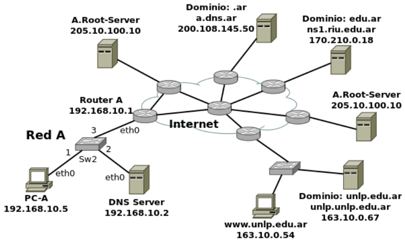
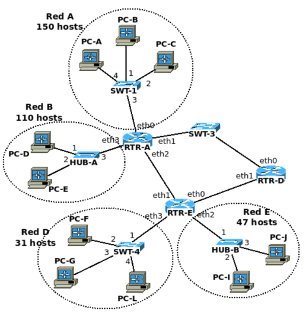

# 1) Dada la siguiente topología y considerando que:
● DNS Server es resolver solo para su red.
● unlp.unlp.edu.ar es resolver solo para su red y autoritativo para el espacio de nombres unlp.edu.ar.
● El resto de servidores DNS son solo autoritativos para los dominios que indican.

## a) El servidor unlp.unlp.edu.ar perdió conectividad con Internet. PC-A accede mediante un navegador a www.unlp.edu.ar.
### i) ¿Qué respuestas TCP y HTTP obtendrá PC-A por parte del servidor?
Por parte del servidor la PC-A no obtendrá ninguna respuesta TCP ni HTTP ya que al no poseer conexión a internet, nunca le llegaron los requerimientos.

### ii) ¿Podría obtenerse de algún servidor DNS información autoritativa sobre el nombre unlp.edu.ar?
Si, del servidor dns ns1.riu.edu.ar se podría obtener de forma autoritativa el registro NS asociados al nombre unlp.edu.ar (unlp.unlp.edu.ar) y el registro A asociados al servidor unlp.unlp.edu.ar
<!-- Segun mis tests, no es autoritativa -->

## b) El servidor unlp.unlp.edu.ar recuperó conectividad con Internet y se plantean mejoras a las que deberá indicar qué modificaciones son necesarias realizar tanto en la topología como las configuraciones (de red y registros DNS):

### i) Incorporar en la Red A un segundo servidor DNS autoritativo para unlp.edu.ar.

suponiendo que se le va a asignar una ip 192.168.10.3 al nuevo servidor y tendra un nombre unlp2.unlp.edu.ar.
suponiendo que la dirección pública del router A es: 200.0.0.1

DNS:
- en ns1.riu.edu.ar y en unlp.unlp.edu.ar agregar:
  - unlp.edu.ar NS unlp2.unlp.edu.ar
  - unlp2.unlp.edu.ar A 200.0.0.1

- en unlp2.unlp.edu.ar configurar que será servidor dns secundario y que su servidor primario es unlp.unlp.edu.ar

Red:
- En el router A, que ya debe tener implementado NAT para que sus hosts tengan conexión a internet, se deberá habilitar el port forwarding al puerto 53 hacia la ip 192.168.10.3. 

<!-- smtp: para recibir un mail, necesito mx y a, para enviar solo a -->
### ii) Incorporar en la misma red un servidor de correo saliente que será utilizado por la aplicación www.unlp.edu.ar.
Agregar servidor SMTP
DNS: 
- en unlp.unlp.edu.ar agregar:
  - entrante.unlp.edu.ar A 200.0.0.1
Red:
- ¿habilitar port forwarding para el servidor de correo SMTP a puerto 25?? 
- 
### iii) Incorporar en la misma red dos servidores (mail-uno y mail-dos) de correo entrante para los usuarios del dominio unlp.edu.ar. Mail-dos debe recibir los correos solo si mail-uno se encuentra fuera de servicio.

Agregar servidor SMTP
DNS: 
- en unlp.unlp.edu.ar agregar:
  - unlp.edu.ar mx 1 mail-uno.unlp.edu.ar
  - unlp.edu.ar mx 2 mail-dos.unlp.edu.ar
  - mail-uno.unlp.edu.ar A 200.0.0.1
  - mail-dos.unlp.edu.ar A 200.0.0.1
Red:
- ¿habilitar port forwarding para el servidor de correo SMTP a puerto 25?? 
- 

### iv) Ayudar a servidores de correo de otros dominios a identificar servidores de correo autorizados para el envío de correo bajo el dominio unlp.edu.ar.

es algo con un registro txt.... con un valor sptp

# 2. PC-A y PC-B disponen de múltiples adaptadores de red configuradas con una IP y la máscara de clase. Cada adaptador físico PC-A está conectado directamente con un cable a su respectivo PC-B. Adicionalmente tenemos los siguientes ejecutables que
implementan un cliente y servidor TCP:
● cliente.exe: acepta los parámetros -s <ip_servidor> -p <puerto_servidor>
● servidor.exe: acepta los parámetros -l <ip_escucha> -p <puerto_escucha>

## a) Indique todas las posibilidades en las que puede ejecutar tanto el cliente como el servidor en PC-A utilizando el puerto 3306 como puerto_escucha sin que sea alcanzable por PC-B.

PC-A: servidor.exe -l 127.0.0.1 -p 3306
PC-B: cliente.exe -s 127.0.0.1 -p 3306
No es alcanzable porque es una dirección de loopback

PC-A: servidor.exe -l 192.168.5.9 -p 3306
PC-B: cliente.exe -s 192.168.5.9 -p 3306
No es alcanzable porque forman la ip 192.168.5.9 y 192.168.6.9 son de clase C, por lo que no pueden usarse para la misma red ya que corresponden a diferentes redes.

## b) PC-B está ejecutando el servidor utilizando -p 80 y en -l se indicó la primera dirección alcanzable por PC-A.

La conexión iniciada por PC-A (ISN: 1000) a PC-B (ISN: 2000).
PC-A envía un segmento con 20 bytes.
PC-B reconoce el segmento de 20 bytes
PC-A envía dos segmentos de 30 bytes.
PC-B responde reconociendo el segmento nuevamente el segmento de 20 bytes.
PC-A envía un segmento de 50 bytes.
PC-B responde reconociendo el segmento nuevamente el segmento de 20 bytes.

Haga un diagrama en el que se refleje el flujo de intercambios, indicando (seq, ack, flags, length). 
Y explique qué suceso está ocurriendo en la red ¿en que parte de la comunicación ubicaría el problema?.

PC-A --> PC-B: flags:[S], seq:1000 
PC-B --> PC-A: flags:[SA], seq:2000, ack:1001
PC-A --> PC-B: flags:[A], seq:1001, ack:2001

PC-A --> PC-B: flags:[A], seq:1001,  ack: 2001, len:20 <!-- PC-A envía un segmento con 20 bytes. -->
PC-B --> PC-A: flags:[A], seq:2001,  ack: 1021 <!-- PC-B reconoce el segmento de 20 bytes -->
PC-A --> PC-B: flags:[A], seq:1021,  ack:2001, len:30 <!-- PC-A envía dos segmentos de 30 bytes. -->
PC-A --> PC-B: flags:[A], seq:1051,  ack:2001, len:30
PC-B --> PC-A: flags:[A], seq:2001,  ack:1021 <!-- PC-B responde reconociendo el segmento de 20 bytes. -->
PC-A --> PC-B: flags:[A], seq:1021,  ack:2001, len:50<!-- PC-A envía un segmento de 50 bytes. -->
PC-B --> PC-A: flags:[A], seq:2001,  ack:1021  <!-- PC-B responde reconociendo el segmento de 20 bytes. -->

los segmentos tcp con len:30 y len:50 no han llegado a PC-B, por lo que puede ser un problema por debajo de la capa de TCP (a nivel de red o enlace).

## c) Haga un diagrama en el que se refleje el flujo de intercambios en el que PC-A envía un segmento a PC-B al puerto 88 en el que ningún proceso está escuchando.

# 3. La siguiente organización dispone de dos bloques de direcciones libres: el primero es 190.10.2.0/23 y solo en caso agotarse disponible de un segundo bloque de direcciones 180.0.0.0/26. Asigne direcciones a todas las redes utilizando VLSM.

Red A tiene 150 hosts, necesita 8 bits de host
Subneteo 190.10.2.0/23 en 2 subredes /24: 
- 190.10.2.0/24 --> red A
- 190.10.3.0/24 

Red B tiene 110 hosts, necesita 7 bits de host
Subneteo 190.10.3.0/24 en 2 subredes /25:
- 190.10.3.0/25 --> red B
- 190.10.3.128/25

Red E tiene 47 hosts, necesita 6 bits de host
Subneteo 190.10.3.128/25 en 2 subredes /26
- 190.10.3.128/26 --> red E
- 190.10.3.192/26 
Red D tiene 31 hosts, necesita 6 bits de host. Le asigno la subred 190.10.3.192/26.

Asigno subredes a las redes entre routers:
Del subnetting 190.10.2.0/23 no me quedaron redes libres, así que usaré 180.0.0.0/26
Necesito 3 subredes /30.

Subneteo 180.0.0.0/26 en 2 subredes /27
- 180.0.0.0/27
- 180.0.0.32/27

Subneteo 180.0.0.0/27 en 2 subredes /28
- 180.0.0.0/28
- 180.0.0.16/28

Subneteo - 180.0.0.0/28 en 4 subredes /30
- 180.0.0.0/30 --> RTR_A -- RTR_D
- 180.0.0.4/30 --> RTR_D -- RTR_E
- 180.0.0.8/30 --> RTR_E -- RTR_A
- 180.0.0.12/30

Subredes asignadas:
- 190.10.2.0/24 --> red A
- 190.10.3.0/25 --> red B
- 190.10.3.128/26 --> red E
- 190.10.3.192/26 --> red D
- 180.0.0.0/30 --> RTR_A -- RTR_D
- 180.0.0.4/30 --> RTR_D -- RTR_E
- 180.0.0.8/30 --> RTR_E -- RTR_A

# 4. Sobre el mismo gráfico del ejercicio 3, escriba la tabla de ruteo de RTR-E.
● El tráfico hacía y desde Red B no debe pasar por RTR-D.
● El tráfico hacía y desde Red A debe pasar por RTR-D.

| Destino      | Mascara | Gateway   | interfaz |
| ------------ | ------- | --------- | -------- |
| 190.10.3.192 | /26     | -         | eth3     | red D          |
| 190.10.3.128 | /26     | -         | eth2     | red E          |
| 180.0.0.4    | /30     | -         | eth0     | RTR_D -- RTR_E |
| 180.0.0.8    | /30     | -         | eth1     | RTR_E -- RTR_A |
| 190.10.3.0   | /25     | 180.0.0.9 | eth1     | red B          |
| 190.10.2.0   | /24     | 180.0.0.5 | eth0     | red A          |
| 180.0.0.0    | /30     | 180.0.0.9 | eth1     | RTR_A -- RTR_D |

# 5. Sobre el mismo gráfico del ejercicio 3, indique:
## a) Cantidad de dominios de broadcast y de colisión.
dominios de broadcast: 7
dominios de colisión: 14

## b) PC-D envía un PING satisfactorio a PC-G. Enumere todos los mensajes recibidos por PC-E durante el evento mencionado

- arp request que realiza la PC-D consultando por el mac de eth3_RTA
- arp response de RTR-A a PC-D
- icmp echo request que envía PC-D a PC-G
- icmp echo response que le envia PC-G a PC-D

## c) PC-B envía un PING a PC-F. Indique los campos de capa de red (origen y destino) y de enlace (origen y destino) cuando el mensaje sale de RTR-A

red:
- ip origen: <ip_PC-B>
- ip destino: <ip_PC-F>

<!-- El tráfico hacía y desde Red A debe pasar por RTR-D. -->
enlace:
- ethernet:
  - mac origen: <mac_eth1_RTR-A>
  - mac destino: ff:ff:ff:ff:ff:ff

- arp:
  - ip origen: <ip_eth1:RTR-A>
  - mac origen: <mac_eth1_RTR-A>
  - ip destino: <ip_eth0_RTR-D>
  - mac destino: 00:00:00:00:00:00

# 6. Indique verdadero o falso para cada una de las siguientes afirmaciones.
## a) Un nodo con una dirección IP 180.10.80.68/26 y con su default gateway 180.10.80.127 no puede navegar en Internet
180.10.80.127 =   180.10.80.01|111111
180.10.80.68/26 = 180.10.80.01|000100

Verdadero, el default gateway posee una dirección de broadcast, la cual no se puede asignar a ningún dispositivo.

## b) Al pertenecer a la familia de estándares 802.11, un dispositivo wireless se puede comunicar directamente con un dispositivo Ethernet
Falso?? <!-- leer teoria de wireles -->

## c) En IPv6 no es necesario usar ARP porque eso se resuelve con el uso de la direcciones de link-local
Falso, se resuelve con el uso de ICMPv6, las direcciones de link-local no son relevantes para la funcionalidad que resuelve en contraposición arp en IPv4<!-- revisar! -->