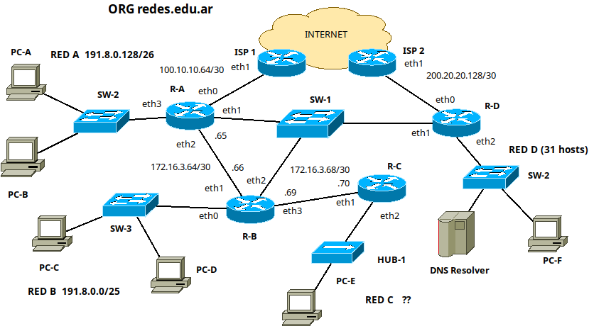
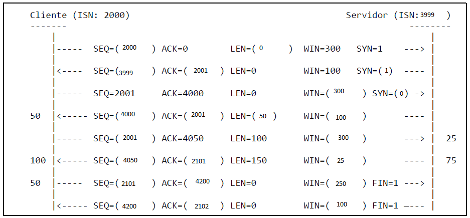

Considerando las siguientes precondiciones siempre que sea posible cumplirlas:
● Todos los routers utilizan los caminos más cortos a excepción de los casos que se indiquen.
● Red A sale a internet vía ISP-1 y Red B, Red C y Red D via ISP-2.
● El tráfico entre Red A y Red D pasa por R-B.
● La organización dispone las redes 191.8.0.0/20 reservada para las redes de oficinas y la red 172.16.3.64/25 reservada para las redes entre entre dispositivos de red.

# 1) Completar el diseño de la red.
## A. Red C y D. Para ambos casos considerar desperdiciar la menor cantidad de direcciones posible y en especial para red C debe utilizarse una red que permita sumarizar las Redes A, B y C en la tabla de rutas de R-D. Indicar cómo quedaría dicha entrada en la tabla de R-D luego de la sumarización completa.

Redes ya asignadas:
- 191.8.0.0/25 --> Red A
- 191.8.0.128/26 --> Red B

Red C: debería elegir la 191.8.0.192/26, ya que me permite sumarizar las redes A, B y C en una red 191.8.0.0/24:

primero sumarizo las /26:
- 191.8.0.128/26 = 191.8.0.10|000000
- 191.8.0.192/26 = 191.8.0.11|000000
se pueden sumarizar en 191.8.0.128/25

ahora que sumarize las redes B y C en 191.8.0.128/25, veo que la puedo sumarizar con 191.8.0.0/25:
- 191.8.0.0/25   = 191.8.0.0|0000000
- 191.8.0.128/25 = 191.8.0.1|0000000
se pueden sumarizar en 191.8.0.0/24

La entrada en la tabla de R-D quedaría:
- Destino: 191.8.0.0
- Mascara: /24
- Gateway:ip de eth2 en router-B
- Interfaz: eth1
Red D: como necesito 31 direcciones para hosts, necesito 6 bits de host.

Asumiendo que se había subneteado anteriormente hasta /25, la siguiente red libre que tengo es la 191.8.1.0/24.
Subneteo 191.8.1.0/24 en 4 subredes /26:
- 191.8.1.0/26 --> le asigno esta red a la red D
- 191.8.1.64/26
- 191.8.1.128/26
- 191.8.1.192/26

## B. Redes de enlaces.

Resta asignarle a:
Router_A -- Router_B -- Router-D
necesitare 3 bits de host ya que 2 bits no me alcanzan

viendo que ya se usarion la 172.16.3.64/30 y la 172.16.3.68/30, 
asumo que está disponible la red 172.16.3.72/30 y la 172.16.3.76/30, las cuales puedo sumarizar a:
172.16.3.72/29 --> Asigno a [Router_A -- Router_B -- Router-D]

## C. Asigne direcciones de red a todos los dispositivos de la topología. La primera debe ser para el router y las consecutivas para el resto de los dispositivos. Preferentemente sobre el gráfico de la topología.

172.16.3.73 a R-D_eth1

# 2) Todas las tablas están completas y configuradas adecuadamente.
## a) Escriba las rutas contenidas en R-B para llegar a todas las redes.

Tabla de ruteo de R-B:

| Destino       | Mascara | Gateway     | Interfaz |
| ------------- | ------- | ----------- | -------- |
| 191.8.0.0     | /25     | -           | eth0     | red B   |
| 172.16.3.68   | /30     | -           | eth3     |
| 172.16.3.64   | /30     | -           | eth1     |
| 172.16.3.72   | /29     | -           | eth2     |
| 191.8.0.128   | /26     | 172.16.3.65 | eth1     | red A   |
| 100.10.10.64  | /30     | 172.16.3.65 | eth1     |
| 191.8.0.192   | /26     | 172.16.3.70 | eth3     | red C   |
| 191.8.1.0     | /26     | 172.16.3.73 | eth2     | red D   |
| 200.20.20.128 | /30     | 172.16.3.73 | eth2     |
| 0.0.0.0       | /0      | 172.16.3.73 | eth2     | default |

(podria reducir las ultimas 3 en 1 creo, ya q tienen el el mismo gateway)

## b) Ocurre un evento y el enlace entre R-B y SW-1 queda fuera de servicio. Indique sólo los cambios que haría y en qué dispositivo, de manera que no se interrumpa el acceso a Internet.

en router B cambiaria toda que salga por eth2 hacia el router R-A usando la interfaz eth1, o sea, hacia 172.16.3.65. Directamente se puede cambiar el default gateway a eth1.

# 3) Incluya un servidor de mail completo en la Red D aportando todas las configuraciones de red necesarias. Tenga en cuenta que se requiere que permita leer, enviar y recibir correos. Debido al bajo presupuesto, debe elegir los protocolos de correo más óptimos en uso de recursos. Mencione las desventajas de la solución propuesta.

Al servidor de correo, le asignaría la ip 191.8.1.4/26

Elegiría los protocolos SMTP y POP3,.....
<!-- falta desventajas -->

Agregaría al servidor dns autoritativo de "redes.edu.ar" los siguientes registros:
- redes.edu.ar MX 1 mail.redes.edu.ar
- mail.redes.edu.ar A 191.8.1.4

El registro MX es relevante para poder recibir los correos desde los MTA de otros dominios.

# 4) Sabiendo que Cliente inició una comunicación FTP con Servidor. En los laterales se indica lo consumido por cada proceso cliente y servidor respectivamente, finalmente las flechas indican el sentido de la comunicación.

## A) Complete los datos faltantes (entre paréntesis) de la secuencia.
hecho.
## B) ¿Cómo se determina y en qué se diferencia una conexión FTP Pasiva o Activa?. ¿Alcanza la información que se brindó para determinar de cuál modo se trata?.
Se diferencia en que en la activa, para la transmisión de datos, el servidor debe realizar la conexión a un puerto que le indique el cliente (desde el puerto 20 del servidor). En cambio, en la pasiva, el servidor es el que le indica al cliente en que puerto no reservado éste debe conectarse.

En base a la información brindada, no se puede afirmar si es pasiva o activa, dado que no sabemos en que puerto se están conectando cada uno como para poder discriminar si están en una conexión de datos o de control. En caso de ser una conexión de datos, se podría confirmar que es de tipo Pasiva, ya que es el cliente el que se conecta al servidor.

# 5) Indique todas las direcciones IPv6 con las que se configura una PC utilizando EUI-64 considerando que: Tiene la dirección MAC 2a:e5:8d:96:9a:b4. Está conectada a un segmento de red en el que se recibe un Router Advertisement del prefijo 2901:ccee::/64.

Paso mac a EUI-64:
mac: 2a:e5:8d:96:9a:b4
invierto 7mo bit de "2a": 
- 2a = 00101010 --> 00101000 = 28
agrego FFFE en el medio:
EUI-64: 28:e5:8d:ff:fe:96:9a:b4

a partir del EUI-64 genero direccion IPv6 link local:
- fe80::28e5:8dff:fe96:9ab4/64

a partir del prefijo 2901:ccee::/64 que obtengo del Router Advertisement genero:
- 2901:ccee::28e5:8dff:fe96:9ab4/64

# 6) En base a la topología del ejercicio 1. Si PC-A tiene que comunicarse con PC-F, realizará un requerimiento ARP. ¿Qué datos tiene el requerimiento y respuesta ARP que ocurrirá al salir de R-A? Indique de Ethernet (mac origen y destino) y de ARP (todos los campos).
<!-- Si tengo en cuenta que el tráfico entre Red A y Red D pasa por R-B. -->

Requerimiento:
- Ethernet:
  - mac origen:<mac_eth2_R-A>
  - mac destino:ff:ff:ff:ff:ff:ff
- ARP:
  - ip origen:<ip_eth2_R-A>
  - mac origen:<mac_eth2_R-A>
  - ip destino:<ip_eth1_R-B>
  - mac destino:00:00:00:00:00:00

Respuesta:
- Ethernet:
  - mac origen:<mac_eth1_R-B>
  - mac destino:<mac_eth2_R-A>
- ARP:
  - ip origen:<ip_eth1_R-B>
  - mac origen:<mac_eth1_R-B>
  - ip destino:<ip_eth1_R-B>
  - mac destino:<mac_eth2_R-A>

# 7) En base a la topología del ejercicio 1. ¿Cómo quedaría la tabla CAM de SW-1 luego de que ocurran todos los intercambios (final)?
● PC-B accede a www.google.com
● PC-C hace un intercambio satisfactorio DNS con DNS Resolver

<!-- Si tengo en cuenta que el tráfico entre Red A y Red D pasa por R-B. -->
<!-- pc-b tambien debe hacer solicitud DNS y asumo que su resolver es DNS Resolver-->
| puerto | mac            |
| ------ | -------------- |
| e2     | <mac_eth2_R-B> |
| e3     | <mac_eth1_R-D> |

# 8) Responder V o F y justificar en ambos casos

## A) Un segmento TCP con errores se descarta, cuando vence su RTO el emisor volverá a enviarlo.
Verdadero. El emisor al ver que no recibe el ack del segmento, y al vencer el RTO, vuelve a enviarlo.

## B) La saturación de buffers de un router disparará el control de flujo entre el emisor y receptor.
Falso. El control de flujo se da cada vez que el emisor envía un segmento, donde se incluye el tamaño de la ventana.
En contraste, laa saturación de buffers de un router intermedio provocará el control de congestión.

## C) El registro SOA de un dominio indica entre otros datos la última actualización, TTL por defecto para los registros y el DNS primario.
Verdadero.

## D) Hay casos en los que UDP responde con un protocolo auxiliar.
Verdadero, con ICMP.

## E) Los headers en HTTP permiten optar la versión HTTP deseada del requerimiento.
Verdadero. Aunque la versión de http utilizada se especifica en la primera línea de requerimiento http, se puede realizar un upgrade de versión con los headers:
- Connection: upgrade
- Upgrade: a_protocol/1, example, another_protocol/2.2

