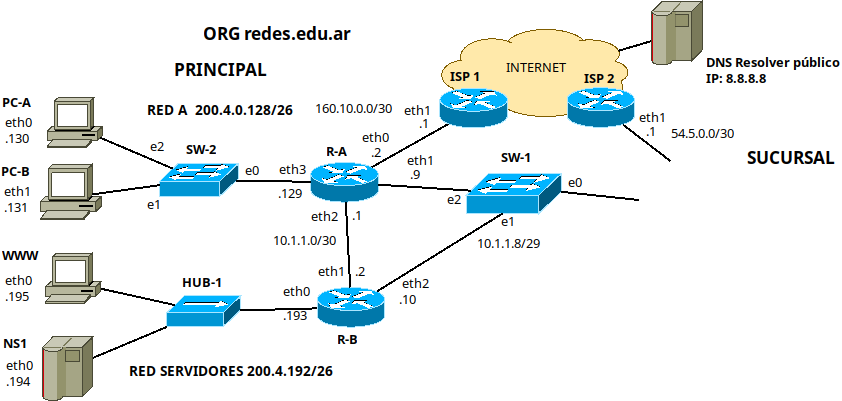
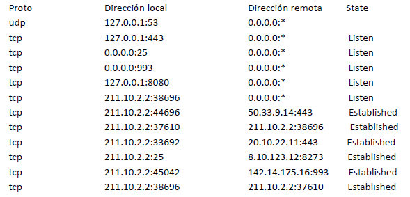
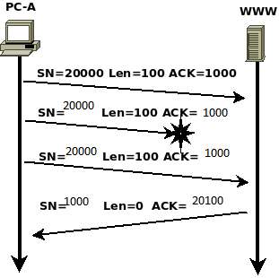

● Al comenzar cada ejercicio todas las tablas de caché, arp, cam… están vacías salvo que se indique lo contrario.
● Todas las respuestas deberán ser debidamente justificadas. En cualquier otro caso serán consideradas incorrectas. La justificación debe
constar de información que demuestre dominio del área.
● El parcial debe realizarse con lapicera.

# 1) Diseñar la red de la sucursal, indicando dispositivos y direccionamiento, siguiendo los lineamientos indicados debajo.
● Dispone de la red 50.0.0.0/16.
● Se requieren dos redes "Red B” y “Servidores Sucursal”, ambas de 62 hosts.
● Habrá una conexión a la Sede Principal mediante SW-1-e0.
● NS1 es el DNS autoritativo para el dominio redes.edu.ar, no hace recursión.

Necesitaré 1 router, y para cada red necesitaré 1 switch. (total:2 switches)

El router tendrá 4 interfaces de red:
- eth0 conectado con SW-1-e0
- eth1 conectado con la red B
- eth2 conectado con "Servidores Sucursal"
- eth3 conectado con eth1_ISP2, útil para el acceso a internet

para 62 hosts se necesitan 6 bits de host, por lo que subneteo la red 50.0.0.0/16 hasta /26 dónde por último me quedan las redes:
- 50.0.0.0/26 --> Red B
- 50.0.0.64/26 --> Servidores Sucursal

<!-- todo: tabla de ruteo -->

# 2) Escriba las rutas incluídas en R-A para alcanzar todas las redes. Siempre que sea posible, sumarizar y utilizar los caminos más cortos.
a) Suponiendo que todos los enlaces están activos.
b) Sólo los cambios que considere necesarios si la interfaz eth1 de R-A se desactiva.


# 3) En base a la siguiente salida completa en PC-A responder y justificar en todos los casos.

```
$ curl -X GET -v protocolo://server/recurso
* Connected to XXXXXXXX (163.10.5.71) port 80 (#0)
< HTTP/1.1 301 Moved Permanently
< Host: www.info.unlp.edu.ar
< User-Agent: curl/7.88.1
< Location: https://XXXXXXX/index.html
< Content-Type: text/html; charset=UTF-8
< Server: Apache2
< Content-Length: 52
<
< <html> <body> mensaje personalizado </body> </html>
```

## a. Con los datos en las cabeceras completar el comando curl.
```
$ curl -X GET -v http://www.info.unlp.edu.ar/home.html
```

## b. Teniendo en cuenta los protocolos intervinientes, ¿Qué protocolo de capa de aplicación fue el primero en salir? ¿Qué información fue solicitada? ¿Y cuál fue la respuesta recibida?

El primero en salir fue el protocolo de capa de aplicación dns.

La información solicitada dns fue el registro dns "A" asocido al nombre "www.info.unlp.edu.ar", eso es así dado que se necesita la ip del servidor que hostea esa página.

La respuesta recibida incluye el registro A asocido al nombre "www.info.unlp.edu.ar" con la IP asociada al servidor, que es 163.10.5.71. 

## c. En base a la respuesta recibida por el comando, ¿se obtuvo el recurso solicitado?
No se obtuvo el recurso asociado, dado que la respuesta tiene un codigo http 301, que significa que el recurso ha sido movido a la url indicada a través del header "Location", que en este caso es https://www.info.unlp.edu.ar/index.html
## d. Con la información disponible, ¿es posible deducir si la conexión es persistente o no?
Es persistente dado que se utiliza http/1.1 y éste se caracteriza por mantener la conexión persistente.

# 4) Dada la salida del comando ss, responda y justifique las preguntas.



## a. ¿Cuántas conexiones establecidas hay? ¿En cuáles actúa como servidor y en cuáles como cliente?
Hay 5 conexiones establecidas.

Hay 1 en la que actua sólo como servidor:
- 211.10.2.2:25 <--> 8.10.123.12:8273

Hay 3 en las que actúa sólo como cliente:
- 211.10.2.2:44696 <--> 50.33.9.14:443
- 211.10.2.2:33692 <--> 20.10.22.11:443
- 211.10.2.2:45042 <--> 142.14.175.16:993

Hay 1 en la que actua cómo servidor y cliente:
- 211.10.2.2:38696 <--> 211.10.2.2:37610

## b. ¿Qué respuesta dará al recibir un segmento TCP desde otro host en la misma red, al puerto 993 con el flag S seteado?
Dará un segmento TCP con el flag SYN y ACK seteado

## c. ¿Qué respuesta dará al recibir un datagrama UDP desde otro host en la misma red con destino al puerto 53?
Dará una respuesta ICMP Port unreachable, porque el único socket udp escuchando en el puerto 53 está escuchando en la dirección de loopback 127.0.0.1 y el único que se puede conectar a esa dirección es el mismo host.

## d. ¿Qué respuesta dará al recibir un segmento TCP desde otro host en la misma red al puerto 8080 con el flag S seteado?
Dará como respuesta un segmento TCP con los flag RST y ACK seteados, el único socket tcp escuchando en el puerto 8080 está escuchando en la dirección de loopback 127.0.0.1 y el único que se puede conectar a esa dirección es el mismo host.

# 5)
## a) Si PC-A tiene un valor de ISN=10000 (ISN=Número de secuencia inicial), ¿cómo quedarían las cabeceras TCP de los mensajes que enviaría PC-A en un saludo de 3 vías? (Defina Ud. los valores usados por el otro extremo)
## b) Complete el siguiente gráfico con los valores correspondiente:




## 6) Teniendo en cuenta las comunicaciones salientes de PC-A cuando ingresa mediante navegador a un sitio alojado en WWW, indique el contenido ARP request y ARP reply de la primera comunicación saliente luego de pasar por el primer router.


# 7) En una de las redes de la topología están experimentando problemas de red, específicamente el administrador notó un exceso de colisiones en la red. Considere sólo la topología de la organización base, sin lo que incluyó posteriormente.

## a) ¿Cuántos dominios de colisión hay en la topología?
## b) ¿Qué opción/es se le ocurre para resolver el problema?
## c) Para la acción que decidió tomar en la respuesta b) ¿afectó en la cantidad de dominios de broadcast y colisión de la topología?. Explique en términos cuantitativos.


# 8) Responder V o F y justificar en ambos casos
## A) A menos que PC-A le dirija tráfico a PC-B, PC-B no podrá ver tráfico de ningún protocolo que provenga de PC-A.

## B) Durante una comunicación TCP, una vez que una parte finaliza la comunicación con FIN, no pueden enviarse más datos en ningún sentido.

## C) El protocolo 802.11 utilizado para WIFI utiliza siempre 4 direcciones MAC.

## D) “::” es una dirección IPv6 válida, utilizada para referenciar a la dirección de loopback.