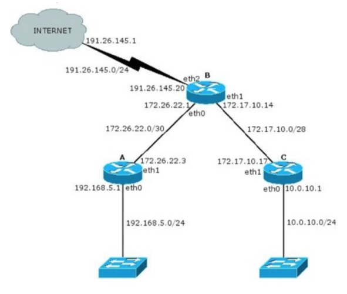
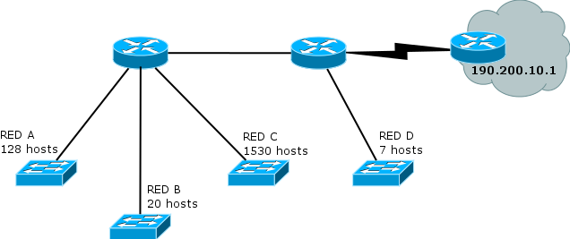
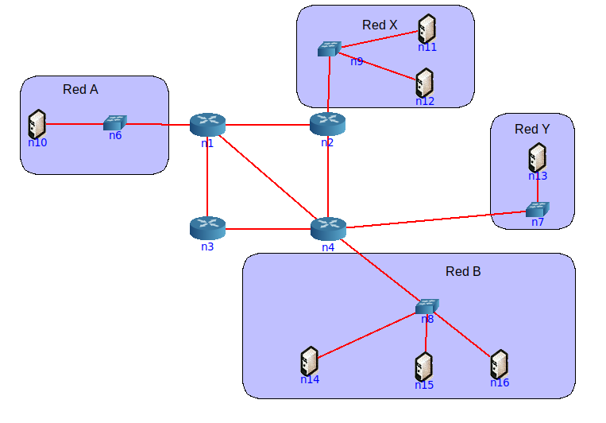

## Introducción
## 1
¿Qué servicios presta la capa de red? ¿Cuál es la PDU en esta capa? ¿Qué dispositivo es considerado sólo de la capa de red?

Se encarga de transportar paquetes desde un host emisor hasta un host receptor.
Proporciona servicios de reenvio y enrutamiento de paquetes entre diferentes hosts. 
Esta capa recibe un segmento de la capa de transporte, lo encapsula en un **datagrama** y lo envia a un host receptor el cual recibira el datagrama y enviará los datos a la capa de transporte.

El router es el dispositivo es considerado sólo de la capa de red. El router no implementa capas superior a la capa de red. Cada router tiene una tabla de reenvio.
## 2
¿Por qué se lo considera un protocolo de mejor esfuerzo?

La capa de red de Internet proporciona un servicio de best-effort, esto indica que el servicio no asegura la temporización relativa entre paquetes, tampoco está garantizado que los paquetes se reciban en el orden que fueron emitidos y tampoco se garantiza la entrega de los paquetes transmitidos. Por tanto, teniendo en cuenta esta definición, una red que no entregara los paquetes al destino satisfaría la definición de servicio de entrega de mejor esfuerzo.

## 3
¿Cuántas redes clase A, B y C hay? ¿Cuántos hosts como máximo pueden tener cada una?
- Clase A:
  - redes: 128  (2^7)
  - hosts: 16777214 ((2^24) -2)
- Clase B:
  - redes: 16384 (2^14)
  - hosts: 65534 ((2^16) -2)
- Clase C:
  - redes: 2097152 (2^21)
  - hosts: 254 ((2^8)-2)

## 4
¿Qué son las subredes? ¿Por qué es importante siempre especificar la máscara de subred asociada?

Básicamente, la división en subredes plantea que si una red de clase desperdicia muchas direcciones IP entonces
la misma sea dividida en N subredes más pequeñas que aprovechen mejor el espacio de direccionamiento

Es importante especificar la máscara de subred para poder diferenciar que bits son de red y que bits son de host.

## 5

¿Cuál es la finalidad del campo Protocol en la cabecera IP? ¿A qué campos de la capa de transporte se
asemeja en su funcionalidad?

indica el protocolo específico de la capa de transporte al que se pasarán los datos contenidos en ese datagrama IP
<!-- TODO: -->

## División en subredes
## 6
Para cada una de las siguientes direcciones IP (172.16.58.223/26, 163.10.5.49/27, 128.10.1.0/23, 10.1.0.0/24, 8.40.11.179/12) determine:

### a. ¿De qué clase de red es la dirección dada (Clase A, B o C)?
172.16.58.223/26: B
163.10.5.49/27: B
128.10.1.0/23: B
10.1.0.0/24: A
8.40.11.179/12: A
### b. ¿Cuál es la dirección de subred?

**172.16.58.223/26**: 172.16.58.***
223 = 11011111
11000000 = 192
subred= 172.16.58.192

163.10.5.49/27: 
128.10.1.0/23: 
10.1.0.0/24: 
8.40.11.179/12: 

### c. ¿Cuál es la cantidad máxima de hosts que pueden estar en esa subred?
172.16.58.223/26: --> 32-26 = 6 --> (2^6)-2 = 62

### d. ¿Cuál es la dirección de broadcast de esa subred?
172.16.58.223/26: --> 11000000 -->  11_111111 -> 255 --> 172.16.58.255

### e. ¿Cuál es el rango de direcciones IP válidas dentro de la subred?
172.16.58.192 - 172.16.58.255
<!-- Duda: son validos los extremos, no? se pueden utilizar del rango de 172.16.58.193 - 172.16.58.254 ?? claro, las q se pueden asignar a los dispositivos-->

## 7
Su organización cuenta con la dirección de red 128.50.10.0. Indique:
<!-- 
DUDA:
PORQUE PREGUNTAN SI UNA DIRECCION DE RED ES UNA DIRECCION DE RED?
EN TODO CASO, NO LO PUEDE SER, NO?
-->
### a. ¿Es una dirección de red o de host?  
128 = 10000000 --> Clase B
128.50.0.0 es la direccion de red
Los 16 bits menos significativos son distinto de 0, por lo que la sección de host está siendo usada.
Entonces es una dirección de host

### b. Clase a la que pertenece y máscara de clase.
Clase B
255.255.0.0

### c. Cantidad de hosts posibles.
(2^16) -2 = 65534

### d. Se necesitan crear, al menos, 513 subredes. Indique:
128.50.10.0

#### i. Máscara necesaria.
<!-- 
ASUMO QUE LA ORGANIZACION CUENTA CON LA DIRECCION DE "RED" 128.50.0.0??
porque 128.50.10.0 es una dirección de host y no me indican la mascara
-->
10000000.00110010|.00001010.00000000
mascara actual de red: /16 por ser clase B (255.255.0.0)

necesito 513 subredes. 2^9 = 512, necesitare 2^10 = 1024
tomo 10 bits mas para la máscara

10000000.00110010.00001010.00|000000
mascara necesaria:
11111111.11111111.11111111.110000000 = 255.255.255.192

#### ii. Cantidad de redes asignables.
2^9 = 1024

#### iii. Cantidad de hosts por subred.
(2^6)-2 = 62

#### iv. Dirección de la subred 710.
<!-- DUDA: A QUE SE REFIERE CON 710?? ARRANCA DESDE 0 O 1 A CONTARSE?? -->
<!-- arrancando a contar desde 1: -->
710 = 1011000110
10000000.00110010.10110001.10|000000
128.50.177.128

#### v. Dirección de broadcast de la subred 710.
10000000.00110010.10110001.10|111111

## 8
Si usted estuviese a cargo de la administración del bloque IP 195.200.45.0/24

### a. ¿Qué máscara utilizaría si necesita definir al menos 9 subredes?
2^3= 8(no me sirve)

2^4 = 16. /(24+4) =

<!-- DUDA: que formato usar? /28 es lo mejor -->
/28
11111111.11111111.11111111.11110000
255.255.255.240

### b. Indique la dirección de subred de las primeras 9 subredes.
195.200.45.0/28 = 
11000011.11001000.00101101.0000|0000

1ra = 11000011.11001000.00101101.0000|0000 = 195.200.45.0/28
2da= 11000011.11001000.00101101.0001|0000 = 195.200.45.16/28
3ra= 11000011.11001000.00101101.0010|0000 = 195.200.45.32/28
4ta= 11000011.11001000.00101101.0011|0000 = 195.200.45.48/28
5ta= 11000011.11001000.00101101.0100|0000 = 195.200.45.64/28
6ta= 11000011.11001000.00101101.0101|0000 = 195.200.45.80/28
7ma= 11000011.11001000.00101101.0110|0000 = 195.200.45.96/28
8va= 11000011.11001000.00101101.0111|0000 = 195.200.45.112/28
9na= 11000011.11001000.00101101.1000|0000 = 195.200.45.128/28

### c. Seleccione una e indique dirección de broadcast y rango de direcciones asignables en esa subred.
2da= 11000011.11001000.00101101.0001|0000 = 195.200.45.16

dir broadcast = 11000011.11001000.00101101.0001|1111 = 195.200.45.31

rango de dir asignables (son 16-2) = 195.200.45.17 a 195.200.45.30 

## 9
Dado el siguiente gráfico:

<!-- Tener en cuenta q en la imagen falta el prefijo de las direcciones asignadas de hosts -->

### a. Verifique si es correcta la asignación de direcciones IP y, en caso de no serlo, modifique la misma para que lo sea.

172.26.22.0/30 = 10101100.00011010.00010110.000000|00
broadcast 172.26.22.0 = 10101100.00011010.00010110.000000|11 = 172.26.22.3
- Router A tiene asignado una dirección de broadcast en eth1, lo cambio por 172.26.22.2

172.17.10.0/28 = 10101100.00010001.00001010.0000|0000
broadcast = 10101100.00010001.00001010.0000|1111 = 172.17.10.15
- eth1 de Router C tiene asignado una dirección ip fuera del rango valido de su red. Le asigno 172.17.10.13

### b. ¿Cuántos bits se tomaron para hacer subredes en la red 10.0.10.0/24? ¿Cuántas subredes se podrían generar?
Es una red privada de clase A, por lo que tenía una mascara inicial de /8
24-8 = 16
Se tomaron 16 bits
Se podrian generar 2^16 subredes, 65536 

### c. Para cada una de las redes utilizadas indique si son públicas o privadas.

192.26.145.0/24 es publica clase C

172.26.22.0/30 es privada clase B

172.17.10.0/28 es privada clase B

192.168.5.0/24 es privada clase C

10.0.10.0/24 es privada clase A

## CIDR
## 10
¿Qué es CIDR (Class Interdomain routing)? ¿Por qué resulta útil?
<!-- TODO:  -->
## 11
¿Cómo publicaría un router las siguientes redes si se aplica CIDR?
<!-- LA cantidad de redes a subnetear debe ser potencia de 2, porque estaria incluyendo redes que no son mias. -->
### a. 198.10.1.0/24
### b. 198.10.0.0/24
### c. 198.10.3.0/24
### d. 198.10.2.0/24
con mascara de /24:
198.10.00000000|.00000000
..
198.10.00000011|.00000000

con mascara de /22:
198.10.000000|00.00000000
..
198.10.000000|11.00000000

<!-- Se publica la primera -->
Publicaría con 198.10.0.0/22

## 12
Listar las redes involucradas en los siguientes bloques CIDR:

### 200.56.168.0/21
<!-- Inicialmente fue clase C porque empieza en 200, por lo que tenia /24 -->

- 11001000.00111000.10101|000.00000000
a
- 11001000.00111000.10101|111.00000000
= 
200.56.175.0

redes involucradas: 200.56.168.0/24 a 200.56.175.0/24 <!-- DUDA: ES NECESARIO USAR ALGUNA MASCARA ACÁ?? DEBERIA USAR /24?? -->

### 195.24.0.0/13
### 195.24/13

## 13.
El bloque CIDR 128.0.0.0/2 o 128/2, ¿Equivale a listar todas las direcciones de red de clase B? ¿Cuál sería el bloque CIDR que agrupa todas las redes de clase A?

<!-- ¿Equivale a listar todas las direcciones de red de clase B? -->
10|000000.00000000.00000000.00000000
a 
10|111111.11111111.11111111.11111111

128.0.0.0 a 191.255.255.255
Si, equivale a listar todas las tirecciones de red de clase B, <!-- DUDA:está ok?? si-->

<!-- ¿Cuál sería el bloque CIDR que agrupa todas las redes de clase A? -->

0.0.0.0/1 <!-- DUDA: ok?? Si -->

## VLSM

## 14
### ¿Qué es y para qué se usa VLSM?
La técnica de VLSM (variable-length subnet masking) consiste en realizar divisiones en subredes con máscaras de longitud variable y es otra de las técnicas surgidas para frenar el agotamiento de direcciones IPv4. Básicamente, VLSM sugiere hacer varios niveles de división en redes para lograr máscaras más óptimas para cada una de las subredes que se necesiten.

## 15
### Describa, con sus palabras, el mecanismo para dividir subredes utilizando VLSM.
Paso 1: Subnetear para la red con mayor cantidad de hosts
Paso 2: De las subredes obtenidas, asignar todas las que se puedan con el menor desperdicio posible
Paso 3: Si aún quedan segmentos de red sin una subred asignada volver al paso 1.

## 16
Suponga que trabaja en una organización que tiene la red que se ve en el gráfico y debe armar el direccionamiento para la misma, minimizando el desperdicio de direcciones IP. Dicha organización posee la red 205.10.192.0/19, que es la que usted deberá utilizar.

### a)
¿Es posible asignar las subredes correspondientes a la topología utilizando subnetting sin vlsm?
Indique la cantidad de hosts que se desperdicia en cada subred.

205.10.192.0/19
11001101.00001010.110|00000.00000000

la red c es la que mas hosts tiene (1530)

para direccionar a 1530 hosts necesito 11 bits (direccionan a max 2048-2 hosts)

205.10.192.0/21
11001101.00001010.110|00|000.00000000

me quedan disponibles 2 bits para subredes, los cuales me permiten direccionar a 4 redes, 
Necesito direccionar a 4 redes + la red entre los 2 routers: total 5 redes. 
**No me alcanzan los bits. No es posible asignar las subredes sin vlsm.**

### b)
Asigne direcciones a todas las redes de la topología. Tome siempre en cada paso la primer dirección de red posible.

<!-- Paso 1: Subnetear para la red con mayor cantidad de hosts -->
- para direccionar a 1530 hosts necesito 11 bits (direccionan a max 2048-2 hosts)

205.10.192.0/21
11001101.00001010.110|00|000.00000000

- me quedan disponibles 2 bits para subredes, los cuales me permiten direccionar a 4 redes, 

<!-- Paso 2: De las subredes obtenidas, asignar todas las que se puedan con el menor desperdicio posible
 -->
- asigno la primera de las subredes a la red C de 1530 hosts.
  - 11001101.00001010.110|00|000.00000000 205.10.192.0/21

<!-- Paso 1: Subnetear para la red con mayor cantidad de hosts -->
la segunda red con mas hosts es la red A, con 128 hosts. Para asignar a esta red con el menor desperdicio posible debo volver a subnetear. Usaré para subnetear la siguiente subred libre:
11001101.00001010.110|01|000.00000000 205.10.200.0/21

<!-- Corregir: subnetear /21 a /22, div /22 a /23 y /23 a /24 -->

necesito 8 bits para los 128 hosts:
11001101.00001010.11001|000.|00000000 205.10.200.0/24
<!-- Paso 2: De las subredes obtenidas, asignar todas las que se puedan con el menor desperdicio posible-->
asigno la primera de las redes de la nueva subred a la red A de 128 hosts:
11001101.00001010.11001|000.|00000000 205.10.200.0/24

<!-- Paso 1: Subnetear para la red con mayor cantidad de hosts -->
la tercera red con mas hosts es la red B, con 20 hosts.

necesito 5 bits para los hosts (2^5 = 32)

Para asignar a esta red con el menor desperdicio posible debo volver a subnetear. Usaré para subnetear la siguiente subred libre: 
11001101.00001010.11001|001.|00000000 205.10.201.0/24

<!-- Paso 2: De las subredes obtenidas, asignar todas las que se puedan con el menor desperdicio posible-->
11001101.00001010.11001001.|000|00000 205.10.201.0/27

A la red B le asigno la subred 205.10.201.0/27

<!-- Paso 1: Subnetear para la red con mayor cantidad de hosts -->
la cuarta red con mas hosts es la red D, con 7 hosts.

necesito 4 bits para los hosts

Para asignar a esta red con el menor desperdicio posible debo volver a subnetear. Usaré para subnetear la siguiente subred libre: 
11001101.00001010.11001001.|001|00000 205.10.201.32/27

<!-- Paso 2: De las subredes obtenidas, asignar todas las que se puedan con el menor desperdicio posible-->
11001101.00001010.11001001.001|0|0000 205.10.201.32/28

A la red D le asigno la subred 205.10.201.32/28

<!-- DEBO ASIGNAR TMB A LA RED QUE NO ESTA ACLARADA (LA QUE NO TIENE HOSTS) ??  -->

A la red entre los 2 routers sin host le asigno la red <!-- si -->
<!-- todo -->
### c)
Para mantener el orden y el inventario de direcciones disponibles, haga un listado de todas las direcciones libres que le quedaron, agrupándolas utilizando CIDR.
<!--

Direcciones libres??
O
redes libres?? Redes libres esta ok porque son banda
-->

11001101.00001010.110|10|000.00000000 
11001101.00001010.110|11|000.00000000 
11001101.00001010.11001|010.|00000000
11001101.00001010.11001|011.|00000000
11001101.00001010.11001|100.|00000000
11001101.00001010.11001|101.|00000000
11001101.00001010.11001|110.|00000000
11001101.00001010.11001|111.|00000000
11001101.00001010.11001001.|010|00000
11001101.00001010.11001001.|011|00000
11001101.00001010.11001001.|100|00000
11001101.00001010.11001001.|101|00000
11001101.00001010.11001001.|110|00000
11001101.00001010.11001001.|111|00000
<!-- Seguir?? -->
<!-- TODO -->

### d)
Asigne direcciones IP a todas las interfaces de la topología que sea posible.
<!-- TODO -->

## 17
Utilizando la siguiente topología y el bloque asignado, arme el plan de direccionamiento IPv4 teniendo en cuenta las siguientes restricciones: 
Utilizar el bloque IPv4 200.100.8.0/22.

- a. La red A tiene 125 hosts y se espera un crecimiento máximo de 20 hosts.
- b. La red X tiene 63 hosts.
- c. La red B cuenta con 60 hosts
- d. La red Y tiene 46 hosts y se espera un crecimiento máximo de 18 hosts.
- e. En cada red, se debe desperciciar la menor cantidad de direcciones IP posibles. En este sentido, las redes utilizadas para conectar los routers deberán utilizar segmentos de red /30 de modo de desperdiciar la menor cantidad posible de direcciones IP.

<!-- rta: -->

Bloque inicial: 200.100.8.0/22 = 200.100.000010|00.00000000

Orden por hosts:
- Red A: 125 hosts + 20 = 145
- Red Y =  46 hosts + 18 = 64
- Red X: 63 hosts 
- Red B = 60 hosts

Red A: 125 hosts + 20 = 145
necesito 8 bits para hosts
subneteo 200.100.8.0/22 y obtengo 4 redes. Asigno la primera a la red A
(200.100.000010|00|.00000000 = 200.100.8.0/24)
**Red A = 200.100.8.0/24**

Red Y =  46 hosts + 18 = 64
necesito 7 bits para hosts
subneteo una de las redes generadas:  (200.100.000010|01|.00000000 o 200.100.9.0/24) y obtengo 2 redes. Asigno la primera a la red Y
200.100.00001001|.0|0000000 = 200.100.9.0/25
**Red Y = 200.100.9.0/25**

Red X: 63 hosts 
necesito 7 bits para hosts
uso la segunda red del subnetting generado anteriormente
(200.100.00001001|.1|0000000 = 200.100.9.128/25)
**Red X = 200.100.9.128/25**

Red B = 60 hosts
necesito 6 bits para hosts
No me quedaron redes libres del anterior subneting, asi que uso una de las redes generadas al subnetear 200.100.8.0/22 para la red A.
subneteo (200.100.000010|10|.00000000 = 200.100.10.0/24)
obtengo (200.100.000010|10|.00|000000 = 200.100.10.0/26)
**Red B = 200.100.10.0/26**

<!-- Asigno direcciones a las redes usadas para conectar los routers -->

n1 - n2
n1 - n3
n1 - n4
n3 - n4
n2 - n4
necesitare 5 redes

<!-- n1-n2: 2 hosts 

uso la para n1-n2 última red disponible del subneting realizado anteriormente para la red A.
(200.100.000010|11|.00000000 = 200.100.11.0/24)
Necesito 2 bits para los hosts, por lo que subneteo esa red:
(200.100.000010|11|.000000|00 = 200.100.11.0/30) -->

<!-- Correccion:
subnetear desde la red obtenida /26

llevar a /30 directamente, lo ideal es ir subneteando de a pasos sino

(200.100.000010|10|.01|000000 = 200.100.10.64/26)

(200.100.00001010.01|000000 = 200.100.10.64/26)
subneteo hasta /30

subneteo 200.100.10.64/26
obtengo 2 subredes:
(200.100.00001010.010|00000 = 200.100.10.64/27)
(200.100.00001010.011|00000 = 200.100.10.96/27)

subneteo 200.100.10.64/27
(200.100.00001010.0100|0000 = 200.100.10.64/28)

(200.100.00001010.01000|000 = 200.100.10.64/29)

(200.100.00001010.010000|00 = 200.100.10.64/30)
 -->

Necesito subnetear para direccionar a 5 redes para 2 hosts cada una. Puedo usar la última red disponible del subneting realizado anteriormente para la red A.
(200.100.000010|11|.00000000 = 200.100.11.0/24)

obtengo 8 redes:
(200.100.000010|11|.000|00000 = 200.100.11.0/27)

uso la primera de esas redes (200.100.000010|11|.000|00000 = 200.100.11.0/27) para direccionar c/u de las 5 redes con 2 hosts c/u

n1-n2
(200.100.000010|11|.000|000|00 = 200.100.11.0/30)

n1 - n3
(200.100.000010|11|.000|001|00 = 200.100.11.4/30)

n1 - n4
(200.100.000010|11|.000|010|00 = 200.100.11.8/30)

n3 - n4
(200.100.000010|11|.000|011|00 = 200.100.11.12/30)

n2 - n4
(200.100.000010|11|.000|100|00 = 200.100.11.16/30)

1.   Asigne direcciones IP en los equipos de la topología según el plan anterior.

**IPs de red A (200.100.8.0/24)**
router n6: 200.100.8.1
hosts(125): 200.100.8.2 a 200.100.8.126

**IPs de red Y (200.100.9.0/25)**
router n7: 200.100.9.1
hosts(46): 200.100.9.2 a 200.100.9.47

**IPs de red X (200.100.9.128/25)**
router n9:200.100.9.129
hosts(63): 200.100.9.130 a 200.100.9.192

**IPs de red B (200.100.10.0/26)**
router n8: 200.100.10.1/26
hosts(60): 200.100.10.61/26

**IPs de red n1-n2 200.100.11.0/30**
hosts(2): 200.100.11.1 y 200.100.11.2

**IPs de red n1-n3 200.100.11.4/30**
hosts(2): 200.100.11.5/30 y 200.100.11.6/30

**IPs de red n1-n4 200.100.11.8/30**
hosts(2): 200.100.11.9/30 y 200.100.11.10/30

**IPs de red n3-n4 200.100.11.12/30**
hosts(2): 200.100.11.13/30 y 200.100.11.14/30

**IPs de red n2-n4 200.100.11.16/30**
hosts(2): 200.100.11.17/30 y 200.100.11.18/30

## ICMP y Configuraciones IP
## 19

Describa qué es y para qué sirve el protocolo ICMP.

Los hosts y los routers utilizan ICMP para intercambiarse información acerca de la capa de red. El uso más típico de ICMP es la generación de informes de error. Por ejemplo, al ejecutar una sesión Telnet, FTP o HTTP, puede encontrarse con un mensaje de error como “Red de destino inalcanzable”. Este mensaje tiene su origen en ICMP. En algún momento, un router IP no ha podido encontrar una ruta hasta el host especificado en su aplicación Telnet, FTP o HTTP, y dicho router ha creado y enviado un mensaje ICMP de tipo 3 a su host para informarle del error.

ICMP a menudo se considera parte de IP pero, en sentido arquitectónico, se encuentra justo encima de IP, ya que los mensajes ICMP son transportados dentro de los datagramas IP. Es decir, los mensajes ICMP son transportados como carga útil de IP, al igual que los segmentos TCP o UDP son transportados como carga útil de IP. De forma similar, cuando un host recibe un datagrama IP con ICMP especificado como el protocolo de la capa superior, demultiplexa el contenido del datagrama para ICMP, al igual que demultiplexaría el contenido de un datagrama para TCP o UDP.
### a. Analice cómo funciona el comando ping.
  Cuando ejecutamos una solicitud de PING, este envía un mensaje ICMP Echo Request al host de destino, y cuando el host de destino le responde, lo hace con un mensaje ICMP Echo Reply. A raíz de esa respuesta, se calcula el tiempo mínimo, medio y máximo de respuesta. En caso de no recibir respuesta en un tiempo predeterminado, nos llegará el mensaje de que no hay conexión con el host, la red es inalcanzable o que no se encuentra la ruta al host.

  Está pensado para probar conectividad IP entre dos hosts.Sirve para medir el RTT min/avg/max/dev y loss, de esta forma poder diagnosticar problemas.
  Si un nodo recibe un ICMP Echo Request, debe responder copiando el contendio con un Echo Reply (PONG).
  #### i. Indique el tipo y código ICMP que usa el ping.
  Ping envía un mensaje ICMP de Echo Request, de tipo 8 y con código 0.

  #### ii. Indique el tipo y código ICMP que usa la respuesta de un ping.
  El host responde con un mensaje ICMP Echo Reply, de tipo 0 y código 0.

### b. Analice cómo funcionan comandos como traceroute/tracert de Linux/Windows y cómo manipulan el campo TTL de los paquetes IP.

traceroute -n 10.0.0.1

Traceroute and tracert accomplish the same general function. The only significant difference is that the command is “traceroute” on Mac and Linux systems and “tracert” on a Windows system.

[fuente](n-able.com/blog/what-is-traceroute-how-does-it-work)

You run a traceroute and specify a maximum of 30 hops. Traceroute will send packets with a TTL of one to the destination server. The first network device the data passes through will decrease the TTL to the value of zero, and a message informing you the packets were dropped is sent. This gives you the RTT for hop number one.

From there, the data packets are sent to the destination server with a TTL of two. As the packets pass through the first hop, the TTL decreases to one. When they pass through the second hop, it decreases to zero. The message is sent again. This gives you the RTT for hop number two.

This process will repeat until the data packets either reach the destination device or it reaches the maximum number of hops. By the end of this test, you will know the number of hops to the destination device, the RTT length for each hop, and the device name and IP address for each hop.

### c. Indique la cantidad de saltos realizados desde su computadora hasta el sitio www.nasa.gov. Analice:

  traceroute -I www.nasa.gov (Use ICMP ECHO for probes)
  traceroute -T www.nasa.gov (Use TCP SYN for probes)

  In the modern network environment the traditional traceroute methods can not be always applicable, because of widespread use of firewalls. Such firewalls filter the "unlikely" UDP ports, or even ICMP echoes.
  #### i. Cómo hacer para que no muestre el nombre del dominio asociado a la IP de cada salta.
  -n: Do not try to map IP addresses to host names when displaying them.
  #### ii. La razón de la aparición de * en parte o toda la respuesta de un salto.

  The asterisks you're seeing are servers that you're packets are being routed through whom are timing out (5.0+ seconds) and so traceroute defaults to printing the *.

  The other thing that will tank traceroute from working, is when a server/router along the way is configured to not reply to ICMP (aka. ping) packets. Without replying to pings, `traceroute's trick of inducing each server by incrementing the TTL (Time To Live) for each packet that it sends to the actual destination, will fail.

### d. Verifique el recorrido hacia los servidores de nombre del dominio unlp.edu.ar. En base al recorrido realizado, ¿podría confirmar cuál de ellos toma un camino distinto?
<!-- DUDA: salvo que use -T, nunca llega a destino -->

## 20
¿Para que se usa el bloque 127.0.0.0/8? ¿Qué PC responde a los siguientes comandos?
### a. ping 127.0.0.1
### b. ping 127.0.54.43

El dispositivo de red loopback es una interfaz de red virtual. Las direcciones del rango 127.0.0.0/8 son direcciones de loopback, de las cuales se utiliza, de forma mayoritaria, la 127.0.0.1 por ser la primera de dicho rango. Las direcciones de loopback pueden ser redefinidas en los dispositivos, incluso con direcciones IP públicas, una práctica común en los routers. 

Esta dirección se suele utilizar cuando una transmisión de datos tiene como destino el propio host. También se suele usar en tareas de diagnóstico de conectividad y validez del protocolo de comunicación.

A pesar de que sólo se usa la dirección única 127.0.0.1, se reservan las direcciones desde la 127.0.0.0 hasta la 127.255.255.255. Cualquier dirección dentro de este bloque producirá un loopback dentro del host local. Las direcciones dentro de este bloque no deben figurar en ninguna red.

## 21
Investigue para qué sirven los comandos ifconfig y route. ¿Qué comandos podría utilizar en su reemplazo?

- El comando Route se utiliza para visualizar y modificar la tabla de rutas.
- Route print muestra una lista con las rutas actuales conocidas por IP para el host.
- Route add se utiliza para añadir rutas a la tabla, y route delete se utiliza para borrar rutas de la tabla.

- El comando ifconfig (configuración de interfaz) es una herramienta de gestión de red. Se utiliza para configurar y ver el estado de las interfaces de red en los sistemas operativos Linux. Con ifconfig, puede asignar direcciones IP, habilitar o deshabilitar interfaces, administrar la caché ARP, rutas y más.

- Actualmente los dos comandos mencionados anteriormente están obsoletos, en su reemplazo se utiliza el comando ip.

Inicie una topología con CORE, cree una máquina y utilice en ella los comandos anteriores para practicar sus diferentes opciones, mínimamente:

**Comandos utiles**

export LANG=C (creo q cambia el idioma de algo de la terminal)

netstat -n (o -nr)

ipconfig eth0 10.0.1.1/24

ip route add default via 10.0.0.1
ip route add 11.0.1.0/24 via 10.0.1.1

ip route del 11.0.1.0/24 via 11.0.1.1

Configurar y quitar una dirección IP en una interfaz

Ver la tabla de ruteo de la máquina.