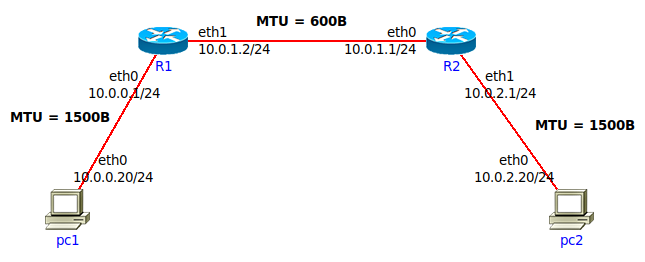
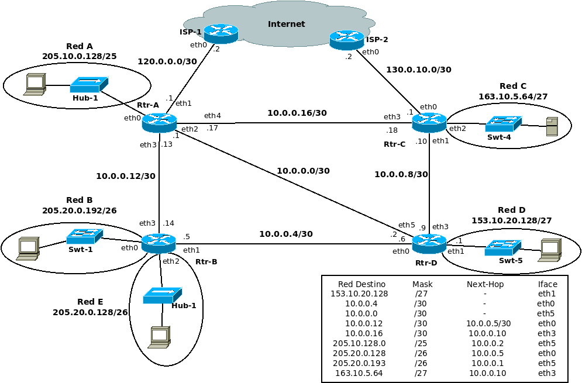
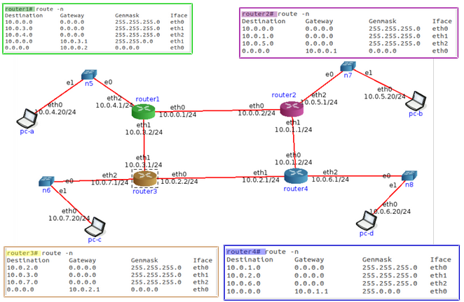
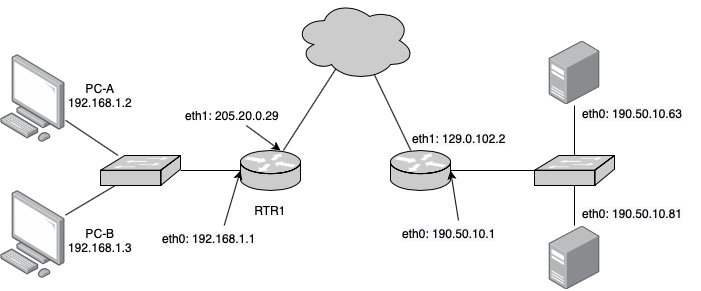
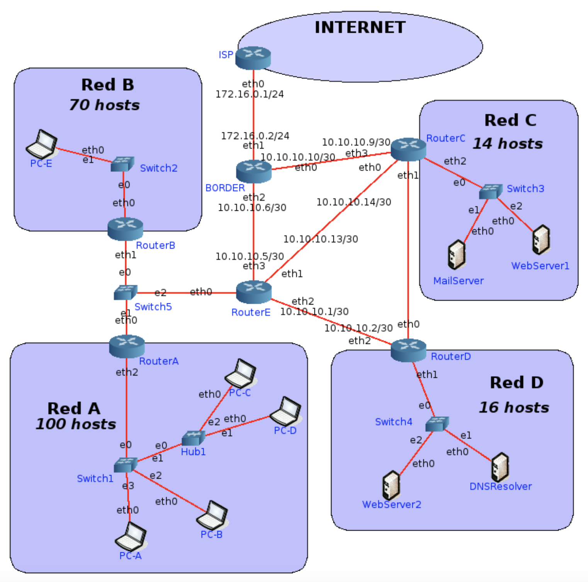
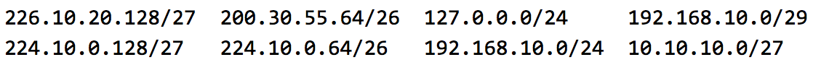

# Fragmentación

# 2
Se tiene la siguiente red con los MTUs indicados en la misma.

Si desde pc1 se envía un paquete IP a pc2 con un tamaño total de 1500 bytes (cabecera IP más payload) con el campo Identification = 20543,
responder:

## Indicar IPs origen y destino y campos correspondientes a la fragmentación cuando el paquete sale de pc1
  - origen: 10.0.0.20
  - destino: 10.0.2.20
  - total length: 1500
  - identification: 0xaaaa
  - DF bit (Do not fragment): 0
  - MF bit (More fragments):0
  - Fragment offset: 0
  
## ¿Qué sucede cuando el paquete debe ser reenviado por el router R1?
  - El mtu del R1 es de 600B, como el Total Length es mayor (1500) y el flag DF está en 0, se fragmenta el paquete
  - (si DF fuera 1, se descarta)

## Indicar cómo quedarían las paquetes fragmentados para ser enviados por el enlace entre R1 y R2.

Tamaño max:600
600 - 20 de headers:580
multiplo de 8 mas cercano: 576 de datos (offsetes en unidades de 8 bytes)

576/8 = 72
1152/8 = 144

<!-- el payload debe ser multiplo de 8 , salvo en el ultimo fragmento-->

| num | tamTotal | id     | DF  | MF  | offset |
| --- | -------- | ------ | --- | --- | ------ |
| 1   | 596      | 0xaaaa | 0   | 1   | 0      |
| 2   | 596      | 0xaaaa | 0   | 1   | 72     |
| 3   | 368      | 0xaaaa | 0   | 0   | 144    |

368 = redondeoAMultiplo8Superior(1500-1152 + 20)

<!-- DUDA: el ultimo paquete lleva mf = 0, no?si -->

## ¿Dónde se unen nuevamente los fragmentos? ¿Qué sucede si un fragmento no llega?
<!-- DUDA: es correcto? -->
Los fragmentos se unen en la capa de ip en pc2 

Si se pierde un fragmento,se descarta el datagrama completo y luego es responsabilidad de la capa superior decidir que hacer. En TCP se produce un timeout y se retransmite el datagrama. En UDP no se retransmite.
<!--DUDA: En que momento se descartan los paquetes que llegaron?? en base a un timeout del SO -->

## Si un fragmento tiene que ser reenviado por un enlace con un MTU menor al tamaño del fragmento, ¿qué hará el router con ese fragmento?

Un paquete fragmentado puede volver a fragmentarse.

# Ruteo

# 3. 
## ¿Qué es el ruteo? ¿Por qué es necesario?
El ruteo consiste en buscar y seleccionar la interfaz de salida y el próximo salto, es decir, encontrar un camino entre todos los posibles.

# 4.
## En las redes IP el ruteo puede configurarse en forma estática o en forma dinámica. Indique ventajas y desventajas de cada método.
Estática:
- Las rutas son establecidas por el administrador manualmente
- Propenso a errores
- Si se cambia la topología requiere cambios manuales en los routers
- Sirve cuando se tiene una red sencilla
- No tiene problemas de seguridad ni de incompatibilidad
- No implica costo de procesamiento extra
- Mayor control
- Esquema NO escalable y NO tolerante a fallos

Dinámica: 
- Requiere una configuración inicial por el administrador
- Si se cambia la topología se adapta de forma automática
- Facilita mantenimiento cuando se tiene una red compleja
- Implica costo de procesamiento extra
- Esquema escalable y tolerante a fallos
- Resolución de Problemas/Debugging, más complejo
- Caminos “óptimos” de acuerdo a la información manejada por el protocolo (métrica, costo)

# 5.
## Una máquina conectada a una red pero no a Internet, ¿tiene tabla de ruteo?
Si, la tabla de ruteo es necesaria para poder comunicar los dispositivos de la red.

<!-- Duda: que significa que no esté conectada a internet?
¿ que no posee ninguna interfaz conectada a la red de internet con ip pública?
 -->

# 6.
Observando el siguiente gráfico y la tabla de ruteo del router D, responder:

## a.
¿Está correcta esa tabla de ruteo? 
En caso de no estarlo, indicar el o los errores encontrados.
Escribir la tabla correctamente (no es necesario agregar las redes que conectan contra los ISPs)

<!-- rta: -->
<!-- DUDA: ESTA OK? FALTA ALGUNO? -->
Errores:
- falta configurar para red 10.0.0.8/30 sin next-hop con Iface eth3
- 10.0.0.12 tiene mal Next-hop: va sin máscara /30
- 205.10.128.0 (red a): no se encuentra esta dirección en ninguna red
  - se cambia por 205.10.0.128 (red a) pero: Next-Hop está mal configurado (10.0.0.2 es ip de Rtr-D), debería ser 10.0.0.1 eth5
- 205.20.0.193/26: no existe esa red. Debería ser:  205.20.0.192/26 , 10.0.0.5, eth5

## b.
Con la tabla de ruteo del punto anterior, Red D, ¿tiene salida a Internet? ¿Por qué? ¿Cómo lo solucionaría? Suponga que los demás routers están correctamente configurados, con salida a Internet y que Rtr-D debe salir a Internet por Rtr-C.

<!-- rta: -->
<!-- DUDA: OK? -->
No tiene salida a internet porque no se configuro el ruteo a la red 120.0.0.0/30 o 130.0.10.0/30

Lo solucionaria agregando a la tabla de rutas:

| Destino    | Mask | Next-hop  | Iface |
| ---------- | ---- | --------- | ----- |
| 130.0.10.0 | /30  | 10.0.0.10 | eth3  |

## c.
Teniendo en cuenta lo aplicado en el punto anterior, si en Rtr-C estuviese la siguiente entrada en su tabla de ruteo, ¿qué sucedería si desde una PC en Red D se quiere acceder un servidor con IP 163.10.5.15?
| Destino    | Mask | Next-hop | Iface |
| ---------- | ---- | -------- | ----- |
| 163.10.5.0 | /24  | 10.0.0.9 | eth1  |
<!-- rta -->

<!-- Duda: ok?? -->
No llegaría al servidor ya que iría por una ruta default hasta el Rtr-C y éste lo rutearía de vuelta al router Rtr-D y comenzaría un loop de ruteo entre los 2 routers.

## d.
¿Es posible aplicar sumarización en esa tabla, la del router Rtr-D? ¿Por qué? ¿Qué debería suceder
para poder aplicarla?

La sumarización es unificar varias redes individuales en una sola entrada de ruteo.

Se podria sumarizar las siguientes redes si no tuvieran diferente interfaz:
10.0.0.0/30
10.0.0.4/30
10.0.0.8/30
10.0.0.12/30
10.0.0.16/30

10.0.0.000|00100
..
10.0.0.000|10000

10.0.0.0/27

como tienen direrente interfaz, la unicas redes que se pueden sumarizar son:

<!-- duda:ok?? no-->
<!-- o solo es:
10.0.0.12/30
10.0.0.16/30
?? ya que 10.0.0.8 está directamente conectada al router?
-->
10.0.0.8/30
10.0.0.12/30
10.0.0.16/30

10.0.0.000|01000
..
10.0.0.000|10000

10.0.0.0/27

| Destino  | Mask | Next-hop | Iface |
| -------- | ---- | -------- | ----- |
| 10.0.0.0 | /27  | -        | eth1  |

<!--  lo que se puede sumarizar es la red B y la E-->

## e.
La sumarización aplicada en el punto anterior, ¿se podría aplicar en Rtr-B? ¿Por qué?

no se puede sumarizar, porque es la que debe diferenciarlas y redireccionarlas por diferentes interfaces

## f.
Escriba la tabla de ruteo de Rtr-B teniendo en cuenta lo siguiente:
- Debe llegarse a todas las redes del gráfico
- Debe salir a Internet por Rtr-A
- Debe pasar por Rtr-D para llegar a Red D <!--duda: puede llegar a red D sin pasar por Rtr-D?? -->
- Sumarizar si es posible

| Destino       | Mask | Next-hop  | Iface |
| ------------- | ---- | --------- | ----- |
| 205.20.0.192  | /26  | -         | eth0  | red B                                    |
| 205.20.0.128  | /26  | -         | eth2  | red E                                    |
| 10.0.0.4      | /30  | -         | eth1  | <!-- DUDA:es necesario? -->              |
| 10.0.0.12     | /30  | -         | eth03 | idem arriba?                             |
| 153.10.20.128 | /27  | 10.0.0.6  | eth1  | red D                                    |
| 205.10.0.128  | /25  | 10.0.0.13 | eth3  | red A                                    |
| 0.0.0.0       | /0   | 10.0.0.13 | eth3  | <!-- default ok?sale por internet aca--> |
| 163.10.5.64   | /27  | 10.0.0.6  | eth1  | red C                                    |

<!--duda: sumarizacion?? -->

## g.
Si Rtr-C pierde conectividad contra ISP-2, ¿es posible restablecer el acceso a Internet sin esperar a que vuelva la conectividad entre esos dispositivos?

<!-- Duda:ok?? -->
Si, derivando el trafico a Rtr A y que Rtr A tenga como default gateway la ip a ISP-1

# 7.
Evalúe para cada caso si el mensaje llegará a destino, saltos que tomará y tipo de respuesta recibida el emisor.

- Un mensaje ICMP enviado por **PC-B a PC-C**.
  - va de pc-b a router2 (asi debería estar configurado en su tabla de ruteo)
  - va de router2 a router1 por el default
  - va de router1 a router3
  - router3 lo envia a su red (la cual está directamente conectada) 10.0.7/24 por interfaz eth2
  - llega a PC-C

  total: 4 saltos PC-B-rt2,rt2-rt1,rt1-rt3,rt3-PC-C

  tipo de respuesta recibida por el emisor: si se envió un PING(echo request), el receptor le responderá al emisor con otro ICMP(echo response).
  Hay que evaluar si la respuesta puede llegar al emisor PC-B:

- Un mensaje ICMP enviado por PC-C a PC-B.
  - va de router3 a router4
  - de router4 va a router2
  - router2 lo manda a su red 10.0.5/24 en la cual está directamente conectada por eth2

8.8.8.8: si todos tienen una salida default: loopea hasta que se acabe el ttl, devolvera un icmp de red inalcanzable

- Un mensaje ICMP enviado por PC-C a 8.8.8.8.
  - 
- Un mensaje ICMP enviado por PC-B a 8.8.8.8.

# DHCP y NAT

# 8.
Con la máquina virtual con acceso a Internet realice las siguientes observaciones respecto de la autoconfiguración IP vía DHCP:

## a. Inicie una captura de tráfico Wireshark utilizando el filtro bootp para visualizar únicamente tráfico de DHCP.

## b. En una terminal de root, ejecute el comando sudo /sbin/dhclient eth0 y analice el intercambio de paquetes capturado.
usé: sudo /sbin/dhclient enp0s3

0.0.0.0	255.255.255.255	DHCP	342	DHCP Request  - Transaction ID 0xeb80ef5f
10.0.2.2	10.0.2.15	DHCP	590	DHCP ACK      - Transaction ID 0xeb80ef5f

## c. Analice la información registrada en el archivo /var/lib/dhcp/dhclient.leases, ¿cuál parece su función?
Se guardan los datos del servidor DHCP, es decir, es una base de datos persistente de todas las conexiones que son válidas.
Si una conexión esta dos veces se toma el ultimo.

O sea, guarda las direcciones ip "alquiladas", con el tiempo de validez incluido

## d. Ejecute el siguiente comando para eliminar información temporal asignada por el servidor DHCP. rm /var/lib/dhcp/dhclient.leases
listo

## e. En una terminal de root, vuelva a ejecutar el comando sudo /sbin/dhclient eth0 y analice el intercambio de paquetes capturado nuevamente ¿a que se debió la diferencia con lo observado en el punto “b”?
<!-- DUDA: que diferencia deberia haber? no noté ninguna diferencia -->

0.0.0.0	255.255.255.255	DHCP	342	DHCP Discover - Transaction ID 0xe17f3f0b
10.0.2.2	10.0.2.15	DHCP	590	DHCP Offer    - Transaction ID 0xe17f3f0b
0.0.0.0	255.255.255.255	DHCP	342	DHCP Request  - Transaction ID 0xe17f3f0b
10.0.2.2	10.0.2.15	DHCP	590	DHCP ACK      - Transaction ID 0xe17f3f0b

## f. Tanto en “b” como en “e”, ¿qué información es brindada al host que realiza la petición DHCP, además de la dirección IP que tiene que utilizar?

Su dirección IP asignada
Cantidad de segundos que le presta la ip
Máscara de subred
Dirección IP de broadcast
Dirección IP del router
Dirección IP del DNS local
Dirección IP del servidor DHCP

# 9.
¿Qué es NAT y para qué sirve? De un ejemplo de su uso y analice cómo funcionaría en ese entorno.
Ayuda: analizar el servicio de Internet hogareño en el cual varios dispositivos usan Internet simultáneamente.

(Network Address Translator)
Es la Traduccion de direcciones de un espacio privado (no “enrutable” en Internet) a un espacio público.

Se encarga de traducir una dirección IP privada a una dirección IP pública o viceversa. Se usa cuando necesitamos que nuestros dispositivos en la red (con IP privadas) se comuniquen a través de internet.

Puede ser NAT basico o NAPT (Network Address Port Translation)

- NAT basico: es “one-to-one”. Mapea una IPv4 privada a una publica y visceversa.
  - Estático: requiere tantas direcciones públicas como privadas
  - Dinámico: no requiere tantas direcciones públicas como privadas, pero sí se requiere un timer por cada entrada. Limita acceso simultaneo de acuerdo al pool pub.
- NAPT: es “one-to-many”. 
  - Permite que varias IP privadas se conecten a internet utilizando una única IP pública. Destacando que en este caso la traducción se realiza usando puertos.
  - En la tabla se mantiene el protocolo y el puerto origen y destino. Se intenta conservar el puerto origen, pero si esta “ocupado” se debe reemplazar por otro.

# 10.
¿Qué especifica la RFC 1918 y cómo se relaciona con NAT?

La RFC 1918 define las direcciones IP privadas, es decir, aquellas que no se utilizan en Internet y que, por lo tanto, se pueden asignar a los host de una intranet situada detrás de un proxy.

Las direcciones privadas son:

Clase A: 10.0.0.0 a 10.255.255.255 con una máscara (10/8) 255.0.0.0.

Clase B: 172.16.0.0 a 172.31.255.255 con una máscara (172.16/12) 255.240.0.0.

Clase C: 192.168.0.0 a 192.168.255.255 con una máscara (192.168/24) 255.255.0.0.

# 11.
En la red de su casa o trabajo verifique la dirección IP de su computadora y luego acceda a www.cualesmiip.com. ¿Qué observa? ¿Puede explicar qué sucede?

Tengo una direccion privada 192.168.0.6, seguramente porque mi red usa NAPT.

# 12.
Resuelva las consignas que se dan a continuación:

## a. En base a la siguiente topología y a las tablas que se muestran, complete los datos que faltan

**PC-A (ss)**
Local Address:    Port Peer Address:Port
192.168.1.2:49273 _________________ (190.50.10.63:80)
_________________ 190.50.10.63:25 (192.168.1.2:37484)
192.168.1.2:_____ 190.50.10.81:8080 (:51238)

**PC-B (ss)**
Local Address:Port Peer Address:Port
192.168.1.3:52734 _________________ (190.50.10.81:8081)
192.168.1.3:39275 _________________ (190.50.10.81:8080)

**RTR-1 (Tabla de NAT)**
Lado LAN          Lado WAN
192.168.1.2:49273 205.20.0.29:25192
192.168.1.2:51238 _________________ (205.20.0.29:16345)
192.168.1.3:52734 205.20.0.29:51091
192.168.1.2:37484 205.20.0.29:41823
192.168.1.3:39275 205.20.0.29:9123

**SRV-A (ss)**
Local Address:  Port Peer Address:Port
190.50.10.63:80 205.20.0.29:25192
190.50.10.63:25 205.20.0.29:41823

**SRV-B (ss)**
Local Address:    Port Peer Address:Port
190.50.10.81:8080 205.20.0.29:16345
190.50.10.81:8081 205.20.0.29:51091
190.50.10.81:8080 205.20.0.29:9123

## b. En base a lo anterior, responda:

### i. ¿Cuántas conexiones establecidas hay y entre qué dispositivos?
192.168.1.2:49273 190.50.10.63:80 
192.168.1.2:37484 190.50.10.63:25 
192.168.1.2:51238 190.50.10.81:8080
192.168.1.3:52734 190.50.10.81:8081
192.168.1.3:39275 190.50.10.81:8080

### ii. ¿Quién inició cada una de las conexiones? ¿Podrían haberse iniciado en sentido inverso? ¿Por qué? Investigue qué es port forwarding y si serviría como solución en este caso.

Las conexiones fueron iniciadas por los clientes hacia los servidores. No se puede iniciar en sentido inverso ya que las PCs tienen direcciones privadas y no se pueden acceder desde internet; para accederlas se debe usar algún mecanismo tipo port-forwarding en el router que tiene alguna IP pública. 

El port forwarding permite a los ordenadores remotos conectarse a un ordenador o servicio específico dentro de una red de área local privada (LAN).

# Ejercicio de repaso

# 13.
Asigne las redes que faltan utilizando los siguientes bloques y las consideraciones debajo:

- 10.10.10.0/27 <!-- privada -->
- 127.0.0.0/24 <!-- no se debería usar -->
- 192.168.10.0/24  <!-- privada-->
- 192.168.10.0/29 <!-- privada -->
- 200.30.55.64/26 
- 224.10.0.64/26 <!-- es ip de multicast?? -->
- 224.10.0.128/27 <!-- es ip de multicast?? -->
- 226.10.20.128/27 <!-- es ip de multicast?? -->

- Red C y la Red D deben ser públicas.
- Los enlaces entre routers deben utilizar redes privadas.
- Se debe desperdiciar la menor cantidad de IP posibles.
- Si va a utilizar un bloque para dividir en subredes, asignar primero la red con más cantidad de hosts y luego las que tienen menos.
- Las redes elegidas deben ser válidas.

<!-- rta: -->

validas:
- 10.10.10.0/27 <!-- privada -->
- 192.168.10.0/24  <!-- privada-->
- 192.168.10.0/29 <!-- privada -->
- 200.30.55.64/26 <!-- publica -->

Red A: privada: 100 hosts
Red B: privada. 70 hosts
Red D: publica. 16 hosts
Red C: publica. 14 hosts
RtA-RtB-RtE: 3 routers
RtC-RtD:2 routers

**Red A** <!-- privada -->
100 hosts: se necesitan 7 bits para hosts, mascara /25

Subneteo 192.168.10.0/24 a 2 redes /25

192.168.10.|0|0000000 = 192.168.10.0/25 --> **red A**
192.168.19.|1|0000000 = 192.168.10.128/25

**Red B** <!-- privada -->
70 hosts: 7 bits de host, mascara /25
tomo la red que me quedó disponible del subneting anterior.
192.168.10.128 --> **red B**

**Red D** <!-- publica -->
16 hosts: 5 bits de host, mascara /27

la unica red pública disponible es 200.30.55.64/26
la subneteo a 2 redes /27:

200.30.55.01|0|00000 = 200.30.55.64/27 --> **red D**
200.30.55.01|1|00000 = 200.30.55.96/27

**Red C** <!-- publica -->
14 hosts: 4 bits de host, mascara /28

subneteo la red publica que me quedo libre del subneting anterior 200.30.55.96/27 a /28:
200.30.55.011|0|0000 = 200.30.55.96/28 --> **Red C**
200.30.55.011|1|0000 = 200.30.55.112/28

**RtA-RtB-RtE**
3 routers: 3 bits de hosts, mascara /29
no puedo usar 192.168.10.0/29 porque quedó inhabilitada al usar la 192.168.10.0/24 <!-- ok?? -->

subneteo 10.10.10.0/27 a 4 redes /29

las redes que están en uso son:
10.10.10.0/30
10.10.10.4/30
10.10.10.8/30
10.10.10.12/30

10.10.10.000|00|000 = 10.10.10.0/29 <!-- en uso -->
10.10.10.000|01|000 = 10.10.10.8/29 <!-- en uso --> 
10.10.10.000|10|000 = 10.10.10.16/29 --> **RtA-RtB-RtE**
10.10.10.000|11|000

**RtC-RtD**
2 routers: 2 bits de hosts, mascara /30
subneteo una red que me quedo libre del subneting anterior 10.10.10.24/29 a 2 redes /30

10.10.10.00011|0|00 = 10.10.10.24/30 --> **RtC-RtD**
10.10.10.00011|1|00 = 10.10.10.28/30

# 14.
Asigne IP a todas las interfaces de las redes listadas a continuación. 
Nota: Los routers deben tener asignadas las primeras IP de la red. 
Para enlaces entre routers, asignar en el siguiente orden:RouterA, RouterB, RouterC, RouterD y RouterE.
- Red A, Red B, Red C y Red D.
- Red entre RouterA-RouterB-RouterE.
- Red entre RouterC-RouterD.

# 15.
Realice las tablas de rutas de RouterE y BORDER considerando:
- Siempre se deberá tomar la ruta más corta.
- Sumarizar siempre que sea posible.
- El tráfico de Internet a la Red D y viceversa debe atravesar el RouterC. <!-- para que me sirve que me diga visceversa en este caso? -->
- Todos los hosts deben poder conectarse entre sí y a Internet.