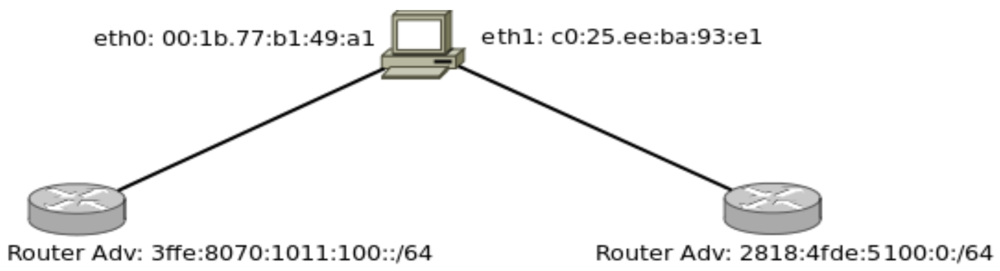

# 1.
¿Qué es IPv6? ¿Por qué es necesaria su implementación?
<!--  -->
IPv6 surge de la necesidad de más direcciones de red ya que con IPv4 no nos alcanzaba.
Los diseñadores de IPv6 también aprovecharon la oportunidad para ajustar y expandir otros aspectos de IPv4.

# 2.
¿Por qué no es necesario el campo Header Length en IPv6?
<!--  -->
El campo Header Length era necesario en IPv4 ya que la cabecera podía tener un tamaño variable, en IPv6 esto no sucede ya que la cabecera tiene un tamaño fijo.

# 3.
¿En qué se diferencia el checksum de IPv4 e IPv6? Y en cuánto a los campos checksum de TCP y UDP, ¿sufren alguna modificación en cuanto a su obligatoriedad de cálculo?
<!--  -->
IPv6 no tiene mas checksum en su cabecera, para evitar procesamiento extra en los routers y hosts.

TCP: siempre fue obligatorio

UDP: con IPv4 era opcional, en IPv6 es obligatorio <!-- DUDA: está ok?? -->

# 4.
¿Qué sucede con el campo Opciones en IPv6? ¿Existe, en IPv6, algún forma de enviar información
opcional?
<!--  -->

El campo opciones en IPv6 se elimina. La cabecera IP estándar ya no incluye un campo de opciones. 
En su lugar, se utilizan Cabeceras de extensión (extension header). Estas cabeceras forman una cadena de cabeceras, a través del campo "Next Header". 
Codigos de ejemplo de Next Header:
| Extension header      | NH  |
| --------------------- | --- |
| Hop-by-Hop Options    | 0   |
| Destination Options   | 60  |
| Routing               | 43  |
| Fragment              | 44  |
| Authentication Header | 51  |
| ------------          | --  |
| TCP                   | 6   |
| UDP                   | 17  |
| ICMPv6                | 56  |

# 5.
Si quisiese que IPv6 soporte una nueva funcionalidad, ¿cómo lo haría?
<!--  -->

Lo agregaria como una opcion al campo de Next Header <!-- ok?? -->

# 6.
¿Es necesario el protocolo ICMP en IPv6? ¿Cumple las mismas funciones que en IPv4?

Los mensajes de ICMP no son obligatorios y, a menudo, no se permiten dentro de una red por razones de seguridad. El protocolo ICMP está disponible tanto para IPv4 como para IPv6. El protocolo de mensajes para IPv4 es ICMPv4. ICMPv6 proporciona estos mismos servicios para IPv6, pero incluye funcionalidad adicional.

ICMPv6 introduce algunas simplificaciones en el envío de mensajes con respecto a ICMPv4, eliminando tipos de mensajes obsoletos que estaban en desuso. Los mensajes ICMPv6 se agrupan en dos tipos o clases: mensajes de error y mensajes informativos. Los mensajes de error tienen cero en el bit de mayor peso del campo Tipo, por lo que sus valores se sitúan entre 0 y 127. Los valores de los mensajes informativos oscilan entre 128 y 255.
<!-- revisar -->

Se añaden tipos y códigos nuevos para dar soporte al descubrimiento de vecinos (Neighbor Discovery y Router Discovery) y manejo de grupos de multicast.

# 7.
Transforme las siguientes direcciones MACs en Identificadores de Interfaces de 64 bits.
00:1b:77:b1:49:a1
e8:1c:23:a3:21:f4

## 00:1b:77:b1:49:a1
1. Tomo el primer octeto y lo paso a binario: 0000 0000
2. invierto el 7mo bit: 0000 0010
3. paso a hexadecimal ese octeto: 02
4. reemplazo el octeto original: 02:1B:77:B1:49:A1
5. agrego :FF:FE: en la mitad: 02:1B:77:FF:FE:B1:49:A1
6. agrego FE80:: al principio: FE80::02:1B:77:FF:FE:B1:49:A1
7. resultado IPv6: FE80::021B:77FF:FEB1:49A1

## e8:1c:23:a3:21:f4
<!-- todo -->

# 8.
¿Cuál de las siguientes direcciones IPv6 no son válidas?

2001:0:1019:afde::1
2001::1871::4 <!-- invalido: hay dos :: :: -->
3ffg:8712:0:1:0000:aede:aaaa:1211 <!-- invalido: la g no forma parte del sistema hexadecimal -->
3::1
::
2001::
3ffe:1080:1212:56ed:75da:43ff:fe90:affe
3ffe:1080:1212:56ed:75da:43ff:fe90:affe:1001 <!-- invalido: la longitud es mayor a 128 bits -->

# 9. ¿Cuál sería una abreviatura correcta de 3f80:0000:0000:0a00:0000:0000:0000:0845?
3f80::a00::845 <!-- invalido -->
3f80::a:845 <!-- invalido -->
3f80::a00:0:0:0:845:4567 <!-- invalido, seria válida sin los 4 bytes del final? -->
3f80:0:0:a00::845
3f8:0:0:a00::845 <!-- invalido: los 0 solo se pueden obviar si están al inicio -->

# 10.
Indique si las siguientes direcciones son de link-local, global-address, multicast, etc.

<!-- 

Las link-local tienen 10 bits de red, 54 bits 0 y 64 bits de IID. El prefijo asignado es FE80::/10 y el utilizado es FE80::/64.

Las site-local tienen 10 bits de red, 54 bits de site Id y 64 bits de IID. El prefijo FEC0::/10. Similar a las redes privadas de IPv4.

Las unique-local tienen 48 bits de unique Id, 16 bits de site Id y 64 bits de IID. El prefijo asignado es FC00::/7 y el utilizado es FD00::/8. Reemplazan las direcciones de Site Local.

Las global-address tienen 48 bits de provideer, 16 bits de site Id y 64 bits de host. El prefijo asignado es cedido por un provider. Es de alcance de internet.

Las multicast-address tienen 16 bits de configuracion (flags y scope) y 112 bits de group ID. El prefijo FF00::/8.

 -->

fe80::1/64
3ffe:4543:2:100:4398::1/64
::
::1
ff02::2
2818:edbc:43e1::8721:122
ff02::9

# 11.

<!-- duda: nodo es igual a host/computadora? -->
<!-- duda: hay q hacer como el ejercicio 7? -->

Dado el siguiente diagrama, ¿qué direcciones IPv6 será capaz de autoconfigurar el nodo A en cada una de sus interfaces?

# 12.
Al autogenerarse una dirección IPv6 sus últimos 64 bits en muchas ocasiones no se deducen de la dirección MAC, se generan de forma random, ¿por qué sucede esto? ¿Qué es lo que se intenta evitar?
(Ver direcciones temporarias, RFC 8981)
<!--  -->

# 13.
Utilizando la máquina virtual abrir la topología llamada 3-ruteo-OSPF.imn para realizar las siguientes pruebas:

## a. Habilitar la vista de las direcciones IPv6 en la topología (View ->show ->IPv6 Addresses).

## b. Esperar a que la red converja. Verificar, mediante ping6, la comunicación entre n6 y n7.

## c. Observar la configuración IPv6:
### i. De la PC n6.
### ii. De la PC n7.
### iii Del router n1.
### iv. La tabla de rutas tanto de las PCs como de los routers.

## d. Responda:
### i. ¿Cuántas direcciones IPv6 se observan tanto en la PC n6 como en la PC n7?
### ii. ¿Es posible desde la PC n7 hacer un ping6 a cada una de las direcciones IPv6 de la PC n6? ¿Por qué?

## e. Cuando se quiere hacer ping6 a una dirección link-local es necesario especificar la interfaz que se quiere utilizar (ping6 -I eth0 <IPv6-address>) ¿Por qué?

## f. Deshabilite la configuración de IPv6 en la PC n7 mediante el comando: sysctl -w net.ipv6.conf.all.disable_ipv6=1
### i. Verifique las IPs configuradas en la PC.
### ii. Luego de deshabilitarse IPv6, ¿puede comunicarse con la PC n6? ¿Cómo?