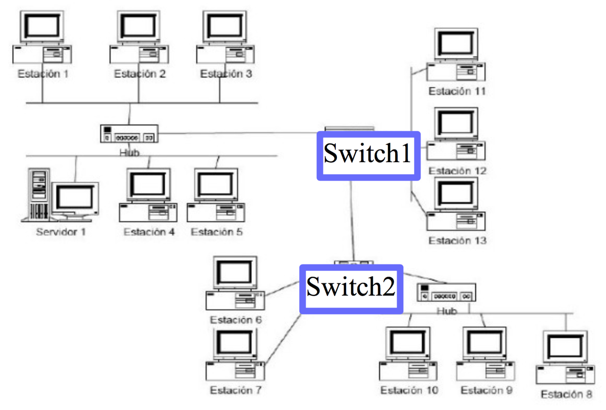
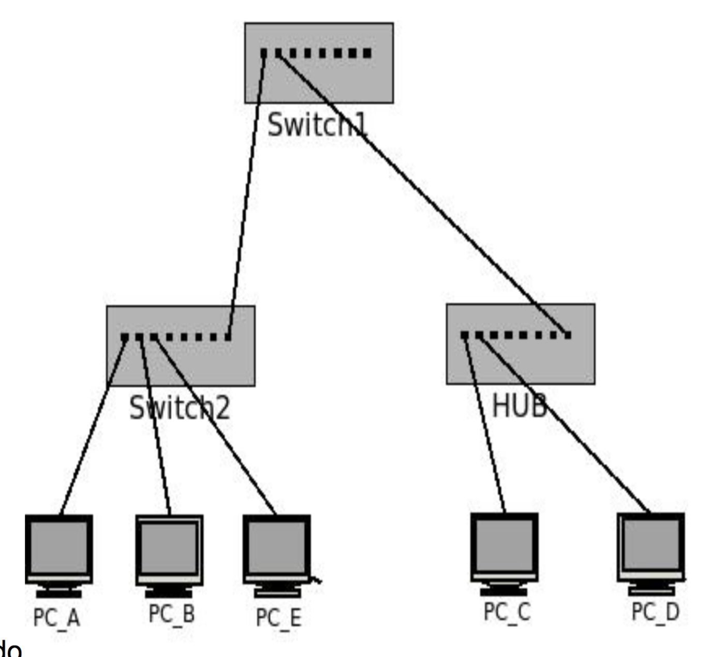

# 1
¿Qué función cumple la capa de enlace? Indique qué servicios presta esta capa.

La capa de enlace se encarga de la comunicación directa entre dispositivos. El protocolo de la capa de enlace define el formato de los paquetes intercambiados por los nodos situados en los extremos del enlace, así como las acciones que estos nodos llevan a cabo cuando se envían y reciben los paquetes.

La PDU de la capa de enlace se denominan tramas (frames), y cada trama de la capa de enlace suele encapsular un datagrama de la capa de red.
# 2
Compare los servicios de la capa de enlace con los de la capa de transporte.

# 3
Direccionamiento Ethernet:
## ¿Cómo se identifican dos máquinas en una red Ethernet?
<!--  -->
Se identifican mediante una dirección MAC (media access control).

## ¿Cómo se llaman y qué características poseen estas direcciones?
La dirección consta de 6 bytes de longitud, lo que da 2^48 posibles direcciones de MAC. Suelen expresarse en notación hexadecimal, indicándose cada byte de la dirección mediante una pareja de números hexadecimales. Una propiedad de las direcciones MAC es que nunca puede haber dos adaptadores con la misma dirección, para esto la IEEE se encarga de gestionar el espacio de direcciones MAC.

## ¿Cuál es la dirección de broadcast en capa de enlace? ¿Qué función cumple?

Al ser una tecnología broadcast todos los nodos escuchan todo.
En el caso de Ethernet realiza la difusión recibiendo tramas con dirección MAC de destino FF.FF.FF.FF.FF.FF.

# 4
Sobre los dispositivos de capa de enlace:
## Enumere dispositivos de capa de enlace y explique sus diferencias.

## ¿Qué es una colisión?
Una colisión se produce cuando la información de un dispositivos se mezcla con la de otro.
Un dominio de colisión es un segmento físico de una red de computadores donde es posible que las tramas puedan "colisionar" (interferir) con otros.

## ¿Qué dispositivos dividen dominios de broadcast?

**Hub**:Repetidores de la capa física. Todos los dispositivos de una red están conectados al Hub. Cuando un dispositivo envía un frame, el Hub lo retransmite hacia todos los demás dispositivos de la red a la misma velocidad. Al tener todos los nodos conectados y no haber buffering pueden causarse colisiones; para controlar y evitar colisiones se puede utilizar un protocolo llamado CSMA/CD. Un Hub tiene topologia estrella. Es no deterministico y si tiene muchos dispositivos conectados puede ser lento.

**Switch**: Es la evolución del Hub. Permite múltiples transmisiones simultaneas, envía los datos provenientes de la computadora de origen solamente a la computadora de destino. Los host se conectan a un switch y el switch hace buffering entre sus hosts. No existen las colisiones. Un switch interconecta dispositivos de una red pero no rutea. El switch conoce dispositivos y genera la tabla de dispositivos al hacerlo, si tiene que mandar información de un nodo a otro y no lo conoce o no tiene en su tabla dirección del segundo nodo entonces tiene que enviarlo por broadcast/multicast, es decir, simulando el funcionamiento de un Hub. Si se envía la información y tiene en su tabla la dirección del segundo nodo, entonces sólo ese nodo recibirá esa información puesto que lo conoce y sabe a quién enviársela.

## ¿Qué dispositivos dividen dominios de colisión?

# 5
## Describa el algoritmo de acceso al medio en Ethernet. ¿Es orientado a la conexión?

En un entorno de medios compartidos, todos los dispositivos tienen acceso garantizado al medio, pero no tienen ninguna prioridad en dicho medio.

Si más de un dispositivo realiza una transmisión simultáneamente, las señales físicas colisionan y la red debe recuperarse para que pueda continuar la comunicación. Las colisiones representan el precio que debe pagar la Ethernet para obtener la sobrecarga baja que se relaciona con cada transmisión.

Ethernet utiliza el acceso múltiple por detección de portadora y detección de colisiones (CSMA/CD)(Carrier Sense Multiple Access with Collision Detection) para detectar y manejar colisiones. 

Para transmitir, el adaptador sondea el medio compartido (no utiliza ningún "slot”, ranura o partición de tiempo, frecuencia o código), es decir, utiliza un mecanismo de detección de colisiones. Si está ocupado, espera hasta que se libere; si está libre, comienza a transmitir la trama. Durante la transmisión se compara la señal en el medio con la transmitida –otro nodo puede haber sensado el canal libre y comenzado a transmitir, detectándose después de un intervalo por el tiempo de propagación del medio-.

Ethernet no es orientado a conexión y no es confiable (no hay acks/nacks).

Los pasos son:

- El adaptador recibe un datagrama de la capa de red y crea la trama.
- Si el adaptador sensa que el canal está libre, éste comienza a transmitir la trama. Si éste sensa canal ocupado, espera hasta que esté libre y transmite.
- Si el adaptador transmite la trama entera sin detectar colisión, se considera transmisión lograda.
- Si el adaptador detecta otra transmisión mientras transmite, aborta y envía una señal de bloqueo (jam)
- Después de abortar, el adaptador entra en backoff exponencial: después de la m-ésima colisión, el adaptador elige un K aleatorio entre {0, 1, 2, …, 2^m-1}. El adaptador espera K·512 periodos de 1 bit y retorna al paso 2.

# 6
¿Cuál es la finalidad del protocolo ARP?

ARP es un protocolo utilizado por los dispositivos que usan el protocolo IP en la capa de red. Funciona de manera similar a un Switch de Ethernet. Se encarga de asignar las direcciones IPv6 y las direcciones MAC correspondientes, o de consultar sobre las direcciones IP de otro dispositivo; tanto las asignaciones como las consultas se inician en Broadcast, hasta que se obtiene la dirección concreta del dispositivo, que el destinatario de esa IP le responde directamente.

# 7
Investigue los comandos *arp* e *ip neigh*. Inicie una topología con CORE, cree una máquina y utilice en ella los comandos anteriores para:
Listar las entradas en la tabla ARP.
Borrar una entrada en la tabla de ARP.
Agregar una entrada estática en la tabla de ARP.

# 8
Dado el siguiente esquema de red, responda:

## a. Suponiendo que las tablas de los switches están llenas con la información correcta, responda quién escucha el mensaje si:
### i. La estación 1 envía una trama al servidor 1.
E1, E2, E3, E4, E5, S1, SWITCH1 <!-- DUDA: E1 INCLUIDA?? -->
### ii. La estación 1 envía una trama a la estación 11.
E1, E2, E3, E4, E5, S1, SWITCH1
+
E11

### iii. La estación 1 envía una trama a la estación 9.

### iv. La estación 4 envía una trama a la MAC de broadcast.

### v. La estación 6 envía una trama a la estación 7.

### vi. La estación 6 envía una trama a la estación 10.

## b. ¿En qué situaciones se pueden producir colisiones?

# 9
En la siguiente topología de red indique:

## a. ¿Cuántos dominios de colisión hay?

## b. ¿Cuántos dominios de broadcast hay?

## c. Indique cómo se va llenando la tabla de asociaciones MAC ->PORT de los switches SW1 y SW2 durante el siguiente caso:
### i. A envía una solicitud ARP consultando la MAC de C.
### ii. C responde esta solicitud ARP.
### iii. A envía una solicitud ARP consultando la MAC de B.
### iv. B responde esta solicitud ARP.

