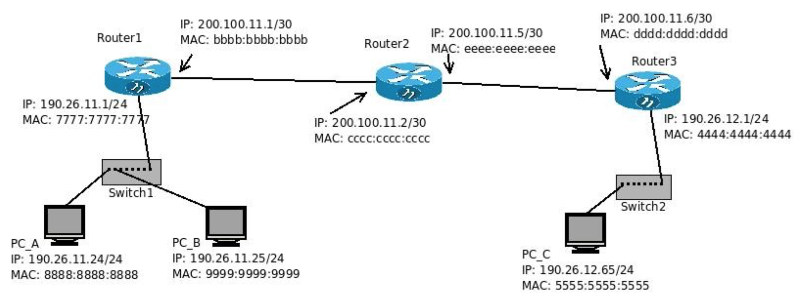

# 1
¿Qué función cumple la capa de enlace? Indique qué servicios presta esta capa.

La capa de enlace se encarga de la comunicación directa entre dispositivos. El protocolo de la capa de enlace define el formato de los paquetes intercambiados por los nodos situados en los extremos del enlace, así como las acciones que estos nodos llevan a cabo cuando se envían y reciben los paquetes.

La PDU de la capa de enlace se denominan tramas (frames), y cada trama de la capa de enlace suele encapsular un datagrama de la capa de red.
# 2
Compare los servicios de la capa de enlace con los de la capa de transporte.

# 3
Direccionamiento Ethernet:
## ¿Cómo se identifican dos máquinas en una red Ethernet?
<!--  -->
Se identifican mediante una dirección MAC (media access control).

## ¿Cómo se llaman y qué características poseen estas direcciones?
La dirección consta de 6 bytes de longitud, lo que da 2^48 posibles direcciones de MAC. Suelen expresarse en notación hexadecimal, indicándose cada byte de la dirección mediante una pareja de números hexadecimales. Una propiedad de las direcciones MAC es que nunca puede haber dos adaptadores con la misma dirección, para esto la IEEE se encarga de gestionar el espacio de direcciones MAC.

## ¿Cuál es la dirección de broadcast en capa de enlace? ¿Qué función cumple?

Al ser una tecnología broadcast todos los nodos escuchan todo.
En el caso de Ethernet realiza la difusión recibiendo tramas con dirección MAC de destino FF.FF.FF.FF.FF.FF.

# 4
Sobre los dispositivos de capa de enlace:
## Enumere dispositivos de capa de enlace y explique sus diferencias.

## ¿Qué es una colisión?
Una colisión se produce cuando la información de un dispositivos se mezcla con la de otro.
Un dominio de colisión es un segmento físico de una red de computadores donde es posible que las tramas puedan "colisionar" (interferir) con otros.

## ¿Qué dispositivos dividen dominios de broadcast?

<!-- switch dividen dominio de colision y router de broadcast!! -->

**Hub**:Repetidores de la capa física. Todos los dispositivos de una red están conectados al Hub. Cuando un dispositivo envía un frame, el Hub lo retransmite hacia todos los demás dispositivos de la red a la misma velocidad. Al tener todos los nodos conectados y no haber buffering pueden causarse colisiones; para controlar y evitar colisiones se puede utilizar un protocolo llamado CSMA/CD. Un Hub tiene topologia estrella. Es no deterministico y si tiene muchos dispositivos conectados puede ser lento.

**Switch**: Es la evolución del Hub. Permite múltiples transmisiones simultaneas, envía los datos provenientes de la computadora de origen solamente a la computadora de destino. Los host se conectan a un switch y el switch hace buffering entre sus hosts. No existen las colisiones. Un switch interconecta dispositivos de una red pero no rutea. El switch conoce dispositivos y genera la tabla de dispositivos al hacerlo, si tiene que mandar información de un nodo a otro y no lo conoce o no tiene en su tabla dirección del segundo nodo entonces tiene que enviarlo por broadcast/multicast, es decir, simulando el funcionamiento de un Hub. Si se envía la información y tiene en su tabla la dirección del segundo nodo, entonces sólo ese nodo recibirá esa información puesto que lo conoce y sabe a quién enviársela.

## ¿Qué dispositivos dividen dominios de colisión?

# 5
## Describa el algoritmo de acceso al medio en Ethernet. ¿Es orientado a la conexión?

En un entorno de medios compartidos, todos los dispositivos tienen acceso garantizado al medio, pero no tienen ninguna prioridad en dicho medio.

Si más de un dispositivo realiza una transmisión simultáneamente, las señales físicas colisionan y la red debe recuperarse para que pueda continuar la comunicación. Las colisiones representan el precio que debe pagar la Ethernet para obtener la sobrecarga baja que se relaciona con cada transmisión.

Ethernet utiliza el acceso múltiple por detección de portadora y detección de colisiones (CSMA/CD)(Carrier Sense Multiple Access with Collision Detection) para detectar y manejar colisiones. 

Para transmitir, el adaptador sondea el medio compartido (no utiliza ningún "slot”, ranura o partición de tiempo, frecuencia o código), es decir, utiliza un mecanismo de detección de colisiones. Si está ocupado, espera hasta que se libere; si está libre, comienza a transmitir la trama. Durante la transmisión se compara la señal en el medio con la transmitida –otro nodo puede haber sensado el canal libre y comenzado a transmitir, detectándose después de un intervalo por el tiempo de propagación del medio-.

Ethernet no es orientado a conexión y no es confiable (no hay acks/nacks).

Los pasos son:

- El adaptador recibe un datagrama de la capa de red y crea la trama.
- Si el adaptador sensa que el canal está libre, éste comienza a transmitir la trama. Si éste sensa canal ocupado, espera hasta que esté libre y transmite.
- Si el adaptador transmite la trama entera sin detectar colisión, se considera transmisión lograda.
- Si el adaptador detecta otra transmisión mientras transmite, aborta y envía una señal de bloqueo (jam)
- Después de abortar, el adaptador entra en backoff exponencial: después de la m-ésima colisión, el adaptador elige un K aleatorio entre {0, 1, 2, …, 2^m-1}. El adaptador espera K·512 periodos de 1 bit y retorna al paso 2.

# 6
¿Cuál es la finalidad del protocolo ARP?

ARP es un protocolo utilizado por los dispositivos que usan el protocolo IP en la capa de red. Funciona de manera similar a un Switch de Ethernet. Se encarga de asignar las direcciones IPv6 y las direcciones MAC correspondientes, o de consultar sobre las direcciones IP de otro dispositivo; tanto las asignaciones como las consultas se inician en Broadcast, hasta que se obtiene la dirección concreta del dispositivo, que el destinatario de esa IP le responde directamente.

# 7
Investigue los comandos *arp* e *ip neigh*. Inicie una topología con CORE, cree una máquina y utilice en ella los comandos anteriores para:
Listar las entradas en la tabla ARP.
Borrar una entrada en la tabla de ARP.
Agregar una entrada estática en la tabla de ARP.

# 8
Dado el siguiente esquema de red, responda:

## a. Suponiendo que las tablas de los switches están llenas con la información correcta, responda quién escucha el mensaje si:
<!-- LOS SWITCH NO SON NECESARIOS PONERLOS -->
### i. La estación 1 envía una trama al servidor 1.
E2, E3, E4, E5, S1, SWITCH1 
### ii. La estación 1 envía una trama a la estación 11.
E1, E2, E3, E4, E5, S1, SWITCH1
+
E11
### iii. La estación 1 envía una trama a la estación 9.
E1, E2, E3, E4, E5, S1, SWITCH1
+
SWITCH2
+
E8, E9, E10

### iv. La estación 4 envía una trama a la MAC de broadcast.
Todos.
El broadcast va a llegar a todas las estaciones y servidores. Los mensajes broadcast son frenados por los routers, es decir, estos no los retransmiten a otra red.
<!-- llega hasta la interfaz del router -->
### v. La estación 6 envía una trama a la estación 7.
SWITCH2
E7

### vi. La estación 6 envía una trama a la estación 10.
SWITCH2
E8, E9, E10

## b. ¿En qué situaciones se pueden producir colisiones?
Sólo se pueden producir colisiones en las partes de la red donde haya un hub. <!-- DUDA: OK?SI -->

# 9
En la siguiente topología de red indique:

## a. ¿Cuántos dominios de colisión hay?
5 
<!-- CADA PUERTO CONECTADO DE SWITCH ES UN DOMINIO DE COLISION -->
PC_C - PC_D - SWITCH1 es un dominio solo??si

## b. ¿Cuántos dominios de broadcast hay?
1 <!-- Porque todos forman parte de la misma red? --> <!-- duda:ok?? si-->

## c. Indique cómo se va llenando la tabla de asociaciones MAC ->PORT de los switches SW1 y SW2 durante el siguiente caso: <!-- duda: como es el procedimiento?? -->

### i. A envía una solicitud ARP consultando la MAC de C.
<!-- el envio le llega a todos, la respuesta solo al camino de vuelta -->
Switch1:
- Puerto 1: <mac de PC_A>

Switch2:
- Puerto 1: <mac de PC_A>

### ii. C responde esta solicitud ARP.

Switch1:
- Puerto 1: <mac de PC_A>
- Puerto 2: <mac de PC_C>

Switch2:
- Puerto 8: <mac de PC_C>
- Puerto 1: <mac de PC_A>

### iii. A envía una solicitud ARP consultando la MAC de B.

Switch1:
- Puerto 1: <mac de PC_A>
- Puerto 2: <mac de PC_C>

Switch2:
- Puerto 8: <mac de PC_C>
- Puerto 1: <mac de PC_A>

### iv. B responde esta solicitud ARP.

Switch1:
- Puerto 1: <mac de PC_A>
- Puerto 2: <mac de PC_C>

Switch2:
- Puerto 8: <mac de PC_C>
- Puerto 1: <mac de PC_A>
- Puerto 2: <mac de PC_B>

## d. 
Si la PC E y la PC D hubiesen estado realizando un tcpdump para escuchar todo lo que pasa por su interfaz de red, 
¿cuáles de los requerimientos/respuestas anteriores hubiesen escuchado cada una?
<!--  -->

PC_E y PC_D Hubieran escuchado las 2 consultas <!-- duda:ok?? -->
PC_D ademas hubiera escuchado la respuesta de PC_C por el hub

# 10
En la siguiente topología:

<!-- las tablas arp estan en los hosts y routers -->

Suponiendo que todas las tablas ARP están vacías, tanto de PCs como de Routers. 
Si la PC_A le hace un ping a la PC_C, indique:

## ¿En qué dominios de broadcast hay tráfico ARP? ¿Con qué direcciones de origen y destino?

<!-- pc_A mira su tabla de ruteo
sale el arp request por interfaz default al ip default
la trama tiene origen mac 8888 y destino ffff

el arp request le llega al router1
le responde el arp response con una trama con origen 7777 y destino 8888

 -->
- primero hago arp por la mac del gateway(yo tengo la ip de mi gateway router1)
-   me llega la mac del router
-   le mando el datagrama con el mensaje icmp al router1

- router1 hace arp a router2
- router 2 le manda su mac a router1
- router1 manda el datagrama con icmp al router2

- idem router2 a router3

- router3 hace arp a PC_C
- PC_C le manda su mac a router3
- router3 manda datagrama con icmp a pc_c

<!-- 
rta:

llega a red tal, tal y tal. (todas)

 -->

## ¿En qué dominios de broadcast hay tráfico ICMP?
<!-- rta:

en todas las redes en este caso

 -->
• ¿Con qué direcciones de origen y destino de capa 2?
<!-- 

origen 8888 destino 7777

origen bbbb destino cccc

origen eeee destino dddd

origen 4444 destino 5555

 -->

• ¿Con qué direcciones de origen y destino de capa 3?

<!-- 
siempre va a ser
origen: 190.26.11.24 dest 190.26.12.65

 -->

## ¿Cuál es la secuencia correcta en la que se suceden los anteriores?

<!-- 
primero dominio de 190,26,11.00/24
despues siguiente red
siguiente red
 -->

# Ejercicio integrador

# 14
Si la PC A está en una red y se quiere comunicar con la PC B que está en otra red:

¿Como se da cuenta la PC A de esto?
- por la tabla de ruteo de PC A

Si la tabla ARP de la PC A esta vacía, ¿que dirección MAC necesita la PC A para poder comunicarse
con la PC B?
- La de su router

En base a lo anterior, ¿que dirección IP destino tiene el requerimiento ARP? ¿Es la dirección IP del
default gateway o es la dirección IP de la PC B? De ser necesario, ejecute de nuevo el experimento
de ser necesario y complete los campos:
- la del router de PC A
- default gateway
- 

Trama Ethernet: (mac origen:____<mac de PC A>_______ mac destino: _____<FFFF>_________)

Solicitud ARP: (mac origen: ______<mac de PC A>________ ip origen:______<ip de PC A>________)
(mac destino: __<00000>___________ ip destino:_______<ip de PC B>_________)

<!-- el q recibe esa solicitud arp, le cambia los 0000 por su mac address (y lo invierte claro) -->

En base a lo anterior, indique la información de capa 2 y 3 del ICMP ECHO REQUEST que la PC A
le envía a la PC B cuando ejecuta un ping, en el segmento de LAN de la PC B.

<!-- se refiere al ultimo recorrido -->

<!-- datagrama ip con mensaje icmp no cambia 
ip origen de pc A ip desitno pc b,

-->

mac origen del router, mac destino del PC B <!-- asumo que tiene su tabla de arp cargada, no hay solic de arp -->

