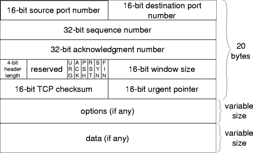

# ESTRUCTURA

# FLAGS

# ESTADOS
- LISTEN
- SYN-SENT
- SYN-RECEIVED

- ESTABLISHED

- FIN-WAIT-1 
- FIN-WAIT-2
- CLOSE-WAIT
- CLOSING
- LAST-ACK
- TIME-WAIT
- CLOSED
# TRANSICION DE ESTADOS
[Estados-tcp](https://users.cs.northwestern.edu/~agupta/cs340/project2/TCPIP_State_Transition_Diagram.pdf)

# Comportamiento ante perdidas y demoras

# VALORES CAMPOS TCP DURANTE UNA CONEXIÓN

## direcciones especiales

## varios ACK indicando win=0. ¿Qué está indicando?

# Posibles respuestas ante situaciones como: 
- ausencia de internet
- pegada a un puerto con un flag seteado

# CLIENTE Y SERVIDOR TCP
<!-- INVESTIGAR!! -->

<!-- 

Adicionalmente tenemos los siguientes ejecutables que
implementan un cliente y servidor TCP:
● cliente.exe: acepta los parámetros -s <ip_servidor> -p <puerto_servidor>
● servidor.exe: acepta los parámetros -l <ip_escucha> -p <puerto_escucha>

a) Indique todas las posibilidades en las que puede ejecutar tanto el cliente como el servidor en PC-A utilizando el puerto 3306 como puerto_escucha sin que sea alcanzable por PC-B.

b) PC-B está ejecutando el servidor utilizando -p 80 y en -l se indicó la primera dirección alcanzable por PC-A.

● La conexión iniciada por PC-A (ISN: 1000) a PC-B (ISN: 2000).
● PC-A envía un segmento con 20 bytes.
● PC-B reconoce el segmento de 20 bytes
● PC-A envía dos segmentos de 30 bytes.
● PC-B responde reconociendo el segmento nuevamente el segmento de 20 bytes.
● PC-A envía un segmento de 50 bytes.
● PC-B responde reconociendo el segmento nuevamente el segmento de 20 bytes.
Haga un diagrama en el que se refleje el flujo de intercambios, indicando (seq, ack, flags, length). Y explique qué suceso está ocurriendo en la red ¿en que parte de la comunicación ubicaría el problema?.

c) Haga un diagrama en el que se refleje el flujo de intercambios en el que PC-A envía un segmento a PC-B al puerto 88 en el que ningún proceso está escuchando.

 -->

# V O F
- Un segmento TCP con errores se descarta, cuando vence su RTO el emisor volverá a enviarlo.
- La saturación de buffers de un router disparará el control de flujo entre el emisor y receptor.
- Hay casos en los que UDP responde con un protocolo auxiliar.